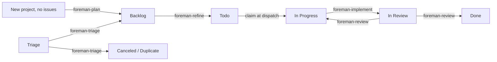

# Foreman

[](https://github.com/andyhite/foreman/actions/workflows/ci.yml)

An [omp](https://github.com/andyhite/oh-my-pi) plugin that runs a
single-operator agile SDLC over [Linear](https://linear.app). Agents move
issues one state to the right; you approve what they propose.

Foreman keeps no database. Linear is the state machine, the queue, and the
audit log: every agent decision lands as a Linear mutation or comment, so the
board you already look at is the whole system state.

## The shape of it



| Agent | Edge | Model | Produces |
| --- | --- | --- | --- |
| `foreman-triage` | Triage → Backlog / Canceled / Duplicate | `@default` | A priority, a `type:` label, dedupe findings |
| `foreman-roadmap` | Initiative brief → sequenced projects | `@plan` | Projects with dependency edges and start/target dates |
| `foreman-plan` | New project (zero issues) → Backlog | `@plan` | A first slate of draft issues from the project brief |
| `foreman-refine` | Backlog → Todo | `@plan` | Acceptance criteria, a Fibonacci estimate, a split proposal |
| `foreman-implement` | In Progress → In Review | `@default` | A branch, tests, a PR, per-criterion evidence |
| `foreman-review` | In Review → Done / In Progress | `@slow` | Findings by severity against the diff |

Six agents, one edge each. An agent returns a validated structured result;
the extension performs the mutation. That split is the design:

- No agent can spawn another: the `task` tool is withheld.
- No agent can write to Linear: no write tool, and the loop scrubs the Linear
  API key from every dispatched agent's environment on both dispatch paths
  (`omp -p` print mode and the herdr pane). Residual exposure: an implement
  agent holds `bash`, so it can read `linear.apiKeyFile` if the credential
  is stored that way. This is defense in depth, not a sandbox; issue content
  is untrusted input.
- A loop-dispatched deployment therefore requires `linear.apiKeyFile`. Both
  dispatch paths (`packages/loop/src/dispatch/print.ts`, `packages/loop/src/dispatch/herdr.ts`)
  scrub `apiKeyEnv`, and the dispatched session's own extension still needs
  a write-capable client to claim locks and apply results. An env-var-only
  deployment cannot support loop dispatch.

Sequence is native Linear relations, never dates or reading order:
`foreman-roadmap` wires `dependency` edges between projects,
`foreman-plan` wires `blocks` edges between the issues it drafts. The loop
reads them back as gates: a project with an unshipped prerequisite is not a
planning candidate; an issue with an open blocker is neither refined nor
implemented.

An agent that cannot proceed neither guesses nor stalls. It yields a
`BlockRecord` naming the question and the options, which becomes a
`blocked:*` label and an entry in the queue you drain with one keypress.

## Install

Requires [Bun](https://bun.sh) 1.3+, `git`, `gh` authenticated for the repos
Foreman will open PRs against, and [omp](https://github.com/andyhite/oh-my-pi).
Foreman is not published as a package: the CLI comes from a clone-and-build,
after which one global symlink points every registered repo at that checkout.

1. **Get the checkout and run `foreman setup`.** One-liner:

   ```bash
   curl -fsSL https://raw.githubusercontent.com/andyhite/foreman/main/scripts/install.sh | bash
   ```

   It clones to `~/.foreman/src`, builds, drops a `foreman` wrapper on
   `$PATH` (`~/.local/bin` by default), and launches `foreman setup`. Extra
   arguments pass through to `setup` (`... | bash -s -- --yes`). Re-running
   pulls, rebuilds, and re-runs setup over your existing config. By hand:

   ```bash
   git clone https://github.com/andyhite/foreman
   cd foreman
   bun install && bun run build
   bun run packages/cli/dist/main.js setup --yes
   ```

2. **Register each repo with `foreman init`, inside that repo.**

   ```bash
   cd ~/Code/my-app
   foreman init
   ```

3. **Bring a machine current later with `foreman update`.** Never re-run the
   installer or a bare `git pull` for this.

### `foreman setup` (once per machine)

Checks for `bun`/`git`/`gh`/`omp`/`herdr`, walks you through the Linear API
key, and writes one symlink: `~/.foreman/plugin -> <checkout>/packages/omp-plugin`.
It never touches repos, initiatives, or teams, and never activates the plugin
anywhere; that is `foreman init`'s job.

Key handling: `$LINEAR_API_KEY` already set → prompt skipped, nothing
validated against Linear (runtime resolves the key the same way). No key or
no network → setup writes none; set `$LINEAR_API_KEY` or `linear.apiKeyFile`
before starting the loop. A pasted key always goes to
`~/.foreman/linear-api-key`, mode `0600`.

| Flag | Does |
| --- | --- |
| `--link` | Symlink `foreman` to a wrapper that execs this checkout's TypeScript source via `bun`; edits take effect with no rebuild. CLI dev mode only; unrelated to the plugin link. |
| `--checkout <path>` | Checkout to link (default: auto-detect this one). |
| `--skip-linear` | Skip the key prompt. |
| `--home <path>` | Home directory for `~/.foreman` (test hook). |
| `-y`, `--yes` | Accept every default non-interactively. |

### `foreman init` (once per repo)

Resolves the repo root (`git rev-parse --show-toplevel`), then:

1. Writes `<repo>/.omp/plugins/omp-plugins.lock.json` and
   `<repo>/.omp/plugins/node_modules/@foreman/omp-plugin` (a symlink to
   `~/.foreman/plugin`), plus a `.git/info/exclude` line so neither shows in
   `git status`. `--skip-plugin` skips both.
2. Lists every initiative in your Linear workspace as a checkbox picker
   (`↑`/`↓` move, `space` toggle, `a` toggle all, `enter` confirm; scrolls
   with `↑ N more` / `↓ N more`), pre-checking any already mapped to this
   repo.
3. Asks for the team and alias. You confirm or edit every choice before it is
   written to `~/.foreman/config.json`.

`foreman init` never prompts for or writes the Linear API key.

| Flag | Does |
| --- | --- |
| `--initiative <uuid>[:subdir]` | Bind an initiative (repeat the flag); `:subdir` is the per-initiative subdirectory binding. |
| `--alias <name>`, `--team <KEY>` | Override the registry alias and Linear team key. |
| `--skip-linear` | Take initiative ids manually instead of querying the API. |
| `--skip-plugin` | Register only; leave `.omp/plugins/` alone. |
| `--path <dir>` | Register a directory other than the current one. |
| `-y`, `--yes` | Accept every default and pre-checked value. On a fresh repo nothing is pre-checked, so init fails unless `--initiative` is also passed. |

The resulting entry:

```json
{
  "repos": {
    "my-app": {
      "path": "~/Code/my-app",
      "initiatives": ["a1b2c3d4-0000-0000-0000-000000000000"]
    }
  },
  "linear": {
    "apiKeyEnv": "LINEAR_API_KEY"
  }
}
```

The `repos` registry, keyed by alias, is the single table binding a repo to
a team and the initiatives it hosts; a monorepo lists several initiatives on
one entry. An issue whose project has no initiative, or whose initiative is
bound to no entry, is skipped rather than guessed at. The key resolves from
`$LINEAR_API_KEY`, else `linear.apiKeyFile`.

### `foreman deinit`, `foreman verify`, `foreman update`

- `foreman deinit` (inside a repo) removes the plugin lock and symlink under
  `.omp/plugins/` and, unless `--keep-registry`, drops the repo's registry
  entry. `--path <dir>` targets another directory.
- `foreman verify` checks the global plugin link and every registered repo's
  activation; a broken symlink or stale lock entry is a problem. `--fix`
  repairs what it can (re-runs the equivalent of `activateRepoPlugin` per
  affected repo); `--checkout <path>` overrides the expected checkout. Exits
  `0` when healthy, `1` when problems remain.
- `foreman update` pulls the checkout and rebuilds the CLI. The plugin loads
  from source, so that is the entire update; every registered repo follows
  the global link with no per-repo work. Flags: `--checkout <path>`,
  `--skip-pull` (rebuild only), `--skip-plugin` (leave the global link
  alone), `--home <path>`.

**Old machine-wide install?** Earlier `foreman setup` registered an omp
marketplace and installed the plugin user-scoped, so it loaded in every omp
session. `foreman verify` detects the leftover; `foreman verify --fix`
removes it. Then `foreman init` in each repo that should have Foreman.

## Running the loop

Order of operations: `setup` once per machine, `init` once per repo,
`update` when Foreman changes upstream. `foreman plan` and `foreman build`
(the per-repo planning and build loops) are not available yet — the CLI
accepts both names and exits `2` with "not yet available" until they land.
`foreman reconcile` is available now and repairs Linear drift a stopped or
crashed loop can leave behind — an orphaned `foreman:running` lock, an
abandoned in-progress issue, a merged PR whose issue never moved to Done, an
`In Review` issue with no PR and an unpushed branch, or a `foreman:blocked`
issue the operator already answered:

```bash
foreman reconcile [alias] [--mode confirm|yolo] [--dry-run]
```

`--dry-run` logs every invariant's fix without applying it or prompting.
`loop.mode` (overridable with `--mode`) defaults to `confirm`: reconcile asks
before every Linear mutation; `confirm` needs a TTY, and a run with no
terminal attached refuses to start rather than declining silently.


## Operator surface

Slash commands inside any omp session:

| Command | Does |
| --- | --- |
| `/foreman:triage` | Propose classification, priority, and destination for a batch of Inbox items. `[--stale-low-days <days>] <ISSUE-ID>...` |
| `/foreman:roadmap` | Decompose an initiative's brief into sequenced projects. `<INITIATIVE-ID>...` |
| `/foreman:plan` | Seed a bare project's first Backlog issues. `<PROJECT-ID>...` |
| `/foreman:refine` | Refine prioritized issues to Todo. `<ISSUE-ID>...` |
| `/foreman:implement` | Implement one ready issue and open its PR. `<ISSUE-ID>` |
| `/foreman:review` | Cold-review in-review diffs. `<ISSUE-ID or PR>...` |
| `/foreman:status` | Operator console: blocked queue, locks, proposals, agents, loop state. |
| `/foreman:apply` | Apply approved triage proposals, or approve/reject one. `[--yes]`, `<ISSUE-ID> --approve`, `<ISSUE-ID> --reject <reason>` |
| `/foreman:merge` | Merge one issue's PR (or branch) once the review gate passes. `<ISSUE-ID>`. Operator-invoked only. |
| `/foreman:unblock` | Record your reply to a blocked issue and clear its `blocked:*` label. `<ISSUE-ID> <reply>` |

## Development

```bash
git clone https://github.com/andyhite/foreman
cd foreman
bun install && bun run build
bun run setup          # setup --link, straight from source
```

```bash
bun run typecheck      # tsc --build --force across the workspace
bun test
bun run contract       # agent/skill/schema wiring check
bun run schemas        # regenerate output schemas into agent frontmatter
bun run check          # typecheck + test + contract
```

The plugin has no build step: `omp.extensions` names `./src/extension.ts`
directly, so a plugin source change just needs a commit. See
`packages/omp-plugin/README.md` for the plugin's layout and editing rules,
and `AGENTS.md` for the conventions agents working on this repo follow.
