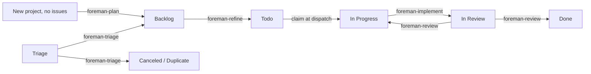

# Foreman

[](https://github.com/andyhite/foreman/actions/workflows/ci.yml)

An [omp](https://github.com/andyhite/oh-my-pi) plugin that runs a single-operator
agile SDLC over [Linear](https://linear.app). Agents move issues one state to the
right; you approve what they propose.

Foreman keeps no database. Linear is the state machine, the queue, and the audit
log. Every decision an agent makes lands as a Linear mutation or a comment, so
the board you already look at is the whole system state.

## The shape of it



Five workflow agents, each responsible for exactly one edge. None of them can
spawn another agent, and none of them can write to Linear — the `task` tool and
Linear's mutation API are both withheld, and the loop scrubs the Linear API key
from every dispatched agent's environment on both dispatch paths (print-mode
`omp -p` and the herdr terminal pane). The one residual exposure the code
cannot close: an implement agent still holds `bash`, so it can read
`linear.apiKeyFile` directly if the operator stores the credential that way.
An agent returns a validated structured result; the extension performs the
mutation. That split is the design. (The `bash` boundary above is
defense-in-depth, not a sandbox — issue content is untrusted input.)

| Agent | Edge | Model | Produces |
| --- | --- | --- | --- |
| `foreman-triage` | Triage → Backlog / Canceled / Duplicate | `@smol` | A priority, a `type:` label, dedupe findings |
| `foreman-plan` | New project (zero issues) → Backlog | session | A first slate of draft issues from the project brief |
| `foreman-refine` | Backlog → Todo | session | Acceptance criteria, a Fibonacci estimate, a split proposal |
| `foreman-implement` | In Progress → In Review | session | A branch, tests, a PR, per-criterion evidence |
| `foreman-review` | In Review → Done / In Progress | `@slow` | Findings by severity against the diff |

An agent that cannot proceed does not guess and does not stall. It yields a
`BlockRecord` naming the question and the options, which becomes a `blocked:`
label and an entry in the drain you resolve with one keypress.

## Install

Requires [Bun](https://bun.sh) 1.3+, `git`, `gh` authenticated for the repos
Foreman will open PRs against, and [omp](https://github.com/andyhite/oh-my-pi).
Foreman isn't published as a standalone package, so getting the CLI still means
a one-time clone-and-build — after that, `foreman setup` registers the plugin
straight from GitHub and none of your other repos need this checkout again.

The one-line installer clones the checkout to `~/.foreman/src`, builds it,
drops a `foreman` wrapper on `$PATH` (`~/.local/bin` by default), and launches
`foreman setup`:

```bash
curl -fsSL https://raw.githubusercontent.com/andyhite/foreman/main/scripts/install.sh | bash
```

It's re-runnable — running it again pulls the latest checkout and re-runs
setup on top of your existing `~/.foreman/config.json`. An already-registered
marketplace or an already-installed plugin is reported as a skip instead of
failing. Extra arguments pass straight through to `foreman setup`, e.g.
`... | bash -s -- --yes --scope user`. Prefer to do it by hand:

```bash
git clone https://github.com/andyhite/foreman
cd foreman
bun install && bun run build
bun run packages/cli/dist/main.js setup --yes --scope user
```

`foreman setup` is the one-time-per-machine installer: it checks for
`bun`/`git`/`gh`/`omp`/`herdr`, walks you through the Linear API key, and
installs the plugin(s) you choose. It never touches repos, initiatives, or
teams — that's `foreman init`'s job (below), run once per repo instead. If
`$LINEAR_API_KEY` is already set, setup skips the key prompt entirely — the
loop and extension resolve the key the same way at runtime, so setup does
not call Linear to validate it. Without a key (or without network access to
Linear), setup falls back to a manual prompt for where to store one. The
default plugin mode is `install` from `andyhite/foreman` on GitHub (both
interactively and under `--yes`, including the piped `curl | bash` path when
stdin is not a TTY). Pass `--link` to symlink this checkout's omp plugin and
the `foreman` CLI instead — dev mode. Drop `--yes` to be walked through the
prompts interactively instead:

`--scope user` (the default) installs the omp plugin across every repo you
work in; `--scope project` scopes it to the current repo.
Run `setup --help` for the full flag list, including `--repo-source` to point
at a fork. `setup` without `--yes` is equivalent to running these by hand:

```bash
omp plugin marketplace add andyhite/foreman
omp plugin install foreman@foreman --scope user
```

Once setup has run, register each repo Foreman will manage by running
`foreman init` **inside that repo**:

```bash
cd ~/Code/my-app
foreman init
```

`foreman init` resolves the repo root with `git rev-parse --show-toplevel`,
then lists every product (initiative) in your Linear workspace as a checkbox
picker (`↑`/`↓` to move, `space` to toggle, `a` to toggle all, `enter` to
confirm) — pre-checking any already mapped to this repo — and scrolls with
`↑ N more` / `↓ N more` when the list is taller than the terminal. It then
asks for the team and alias. You confirm or edit every choice before it's
written to `~/.foreman/config.json`. `--initiative <uuid>[:subdir]` binds
one or more initiatives (repeat the flag; the optional `:subdir` is the
per-initiative subdirectory binding); `--alias <name>` and `--team <KEY>`
override the registry alias and Linear team key. `--skip-linear` takes manual
initiative ids instead of querying the API; `--path <dir>` registers a
directory other than the current one; `-y`/`--yes` accepts every default and
pre-checked value non-interactively — on a repo with no prior registration
that means nothing is selected and init fails unless you also pass
`--initiative`; `--home <path>` overrides `~/.foreman` for testing. `foreman
init` never prompts for or writes the Linear API key — that's `foreman setup`'s
job.

`foreman init` writes an entry like this to `~/.foreman/config.json`'s
`repos` table — or edit it directly:

```json
{
  "repos": {
    "my-app": {
      "path": "~/Code/my-app",
      "initiatives": ["a1b2c3d4-0000-0000-0000-000000000000"]
    }
  },
  "linear": {
    "apiKeyEnv": "LINEAR_API_KEY"
  }
}
```

Foreman reads the Linear personal API key from `$LINEAR_API_KEY`, or from
`linear.apiKeyFile` when the env var is unset — `foreman setup` writes that file
for you (mode `0600`) if you paste a key during the prompt. The `repos`
registry, keyed by alias, is the single table binding a repo to a team and the
initiatives it hosts, each entry written by one `foreman init` run; an issue
whose project has no initiative, or whose initiative isn't bound to any
entry, is skipped rather than guessed at. A monorepo lists several
initiatives on one entry.

Order of operations: `foreman setup` once per machine, `foreman init` once
per repo, then Foreman is **one `foreman repo` instance per repo**: run
`foreman repo [alias] [--team <KEY>]` inside each Foreman-managed
repo — the instance's entry resolves by matching cwd against registry paths,
or the positional alias overrides. The shared Triage inbox is consumed separately, by one
team-level `foreman team [key]` process — not by any repo
instance.

Once installed, day-to-day use is `foreman repo` (below) and the `/foreman:*`
slash commands inside any omp session. See [Development](#development) below
if you want to hack on Foreman itself instead of just running it.

## Running the loop

The supervisor polls Linear and dispatches whatever the gates allow.

```bash
foreman repo --once             # one tick, asking before each action
foreman repo --mode yolo        # unattended
```

`loop.mode` is the global fallback and defaults to `confirm`, so a loop
started before you are ready asks before every agent dispatch and every
Linear mutation instead of acting on them — reads are never gated, and the
loop still evaluates every worker's predicate and logs its intent either
way. Declining is how you get a dry run: say no to everything and the loop
only ever logs. Override an individual worker in `loop.workerModes` when you
want to validate the pipeline one step at a time — `{ "review": "yolo" }`
lets `review` dispatch unattended while every other worker still asks first.
`confirm` mode needs a terminal: a loop started with any worker's effective
mode resolving to `confirm` and no TTY attached refuses to start rather than
declining everything silently. Every tick logs a per-worker summary plus
each dispatch intent and every routing skip to stdout, so there is nothing
for a `--verbose` flag to reveal and `foreman repo` does not take one.
`foreman team` still does, where it adds the skip reason for each triaged
issue.

```
[foreman-repo:plotroom] confirm: dispatch foreman-plan for project Plotroom
[foreman-repo:plotroom]   command: /foreman:plan 8f2c1d90
[foreman-repo:plotroom]   cwd: /Users/you/Code/plotroom
Proceed? [y/N] y
[foreman-repo:plotroom] plan [mode: confirm]: 1 dispatched, 0 would dispatch, 43 skipped
[foreman-repo:plotroom]   ✓ dispatched plan [mode: confirm] 8f2c1d90: "Plotroom" has no issues yet.
```

The `foreman-repo` prefix names the long-lived process, not the command — the
same spelling herdr uses for its pane. The loop is a singleton: a second one
refuses to start while the first holds the lock.

### Control plane

Each loop process — a repo's `foreman repo` and the team-level `foreman
team` — serves a unix socket at `<loop.stateDir>/<loop>/control.sock`,
speaking newline-delimited JSON, and publishes `<loop.stateDir>/<loop>/status.json`
after `reconcile()` and after every tick. Ops: `hello`, `snapshot`,
`subscribe`, `pause`, `resume`, `stop`, `tick`, `setMode`, `patchConfig`,
`reload`, `attachAgent`, `killAgent`, `logs`. `stop` takes
`mode: "graceful" | "now"`: both transition to `draining` and release the
lock once shutdown completes. `"graceful"` lets the in-flight tick finish
every worker in the pass; `"now"` cuts the tick short between workers, wakes
the poll wait immediately, and leaves in-flight dispatches to expire at lock
TTL. The socket is live control; the file is the fallback a client reads
when nothing is listening, which lets a status-reading client render a
stopped loop's last-known state instead of an error. Run `foreman repo
--no-control` to skip the socket entirely.

## Operator surface

Slash commands, inside any omp session:

| Command | Does |
| --- | --- |

[Showing lines 1-300 of 440. Use :301 to continue]