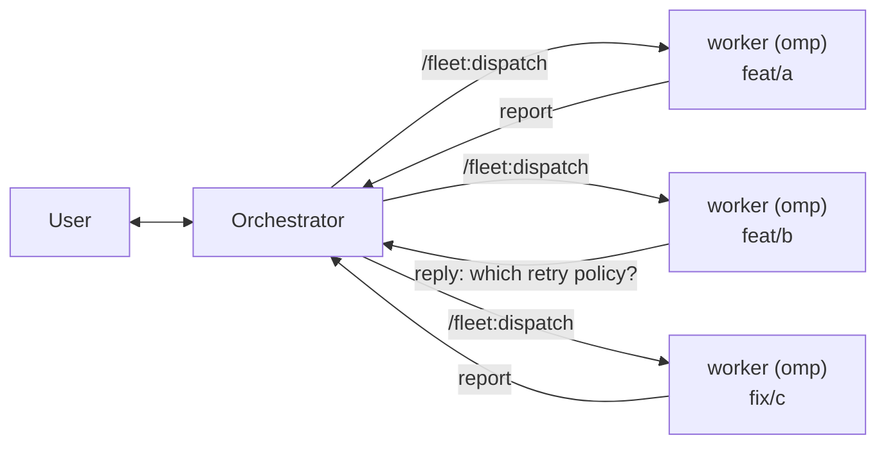

# Foreman

Foreman is a repo with two Fleet plugins that let one agent act as a project
manager and hand the actual engineering to peer agents running on their own
branches:

- **[`herdr/`](./herdr/)** — a herdr plugin providing the `fleet` CLI: create a
  git worktree, start a separate coding agent in it, dispatch work, collect the
  report.
- **the repo root** — an omp-native agent plugin (`package.json`,
  `.omp-plugin/plugin.json`, `command-prompts/`, `skills/`, `extension/`)
  providing the orchestrator's slash commands and custom tools.

Both plugins are named `fleet`; the repo is named `foreman` on GitHub for
where they live, not for any marketplace semantics — there isn't one.

## The idea

omp's `task` subagents share one process: one context window, one working
directory, one lifetime. That is the right tool for work that fits in the
current checkout, and the wrong one for anything that wants a branch.

herdr already has the primitives for the other case — worktrees, panes, named
agents you can address later — and `fleet` is those primitives wired into one
command per dispatch. A worker is a full omp process with its own context
window, sitting in its own worktree, reachable an hour later, and its
deliverable is a branch rather than a message.

This plugin manages the fleet — worktrees, branches, workers, reports — and
nothing else. It has no opinion on *how* a worker does its job and ships no
execution skills of its own. If a worker should follow a particular
procedure — a skill of yours, a house convention, nothing at all — you name
it in the brief, per dispatch, the same way you'd tell a stranger what to do.
Bring your own process.



## Requirements

- [herdr](./herdr/) 0.8.0 or newer, and a herdr pane (`HERDR_ENV=1`)
- `jq` on `PATH`
- macOS or Linux

## Install

Both halves are needed: the herdr plugin supplies the mechanism, the agent
plugin supplies the commands and custom tools.

```sh
herdr plugin install andyhite/foreman/herdr
```

```sh
omp install github:andyhite/foreman
```

For a local checkout instead of GitHub, either command takes a path:

```sh
herdr plugin link ./herdr
omp install ./
```

Installing the omp plugin also registers the `fleet_*` custom tools. Restart
the session afterward — omp loads extension modules at startup, not
mid-session.

## Use

```
/fleet:foreman Ship the webhook retry work in #412 and #413
```

That claims an orchestrator handle for the pane and adopts the role. From
there the orchestrator talks to you, slices the objective, and dispatches
each slice:

```
/fleet:dispatch Add exponential backoff to the webhook dispatcher.
Tests in tests/webhooks/. Do not change the public dispatch() signature.
```

Every dispatch does the same three things: check that the requirements are
precise enough to hand to a stranger, write a brief to a file, and dispatch
a worker against it (the `fleet_spawn` tool, or `fleet spawn` on the CLI —
they are the same operation). The spawn is always this shape:

```bash
fleet spawn <branch> --tier <standard|deep> \
  [--role <name>] [--skill <name> ...] --task-file <brief>
```

`--role` is optional and appears at most once. It resolves through `roles:` in
fleet's config (`fleet roles` shows the mapping) to one skill instruction.
Use it for a named convention, such as `review`, whose mapped skill may change
without rewriting every dispatch. `--skill <name>` is repeatable; each named
skill prepends `Before doing any other work, read skill://<name> and follow
it.` to the worker prompt, in flag order. When both are present, the
role-mapped instruction comes first, then every literal skill instruction.
Leave both absent and the worker gets the brief alone. Fleet then appends its
protocol block telling the worker how to commit, file its report, stay in its
worktree, and interrupt the orchestrator with a question. Briefs repeat none
of those instructions.

## Invocation control

`skills/*/SKILL.md` are auto-discovered through omp's conventional plugin
scanning; `user-invocable: false` keeps `fleet-orchestrate`, `fleet-worker`,
and `fleet-dispatch` out of the bare `/fleet` slot — that namespace is noise
once `fleet:<name>` commands exist — while staying reachable to a model, and
to any session through `skill://<name>`, which reads the file directly and
ignores the flag.

The two orchestrator commands work differently: `extension/index.ts` reads
`command-prompts/*.md` at load and registers each directly as `fleet:<name>`
— see [Install](#install) for why. A dispatch command creates a branch, a
worktree, and a live agent process: a side effect a user asks for, never one
a model decides on its own. Registering it directly, rather than through any
auto-discovery path, is what guarantees that — there is no frontmatter flag
to set on that side, only the skills need one.

## Skills

- `skill://fleet-dispatch` — the orchestrator/worker split and brief shape
- `skill://fleet-orchestrate` — spawning, joining, replying, reporting, and reaping
- `skill://fleet-worker` — reporting, asking a blocked question, and peer messaging from a worker

Details: [`herdr/README.md`](./herdr/README.md) for the CLI.
