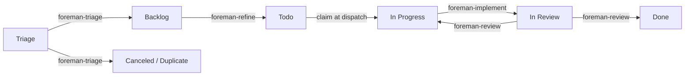

# Foreman

[](https://github.com/andyhite/foreman/actions/workflows/ci.yml)

An [omp](https://github.com/andyhite/oh-my-pi) plugin that runs a single-operator
agile SDLC over [Linear](https://linear.app). Agents move issues one state to the
right; you approve what they propose.

Foreman keeps no database. Linear is the state machine, the queue, and the audit
log. Every decision an agent makes lands as a Linear mutation or a comment, so
the board you already look at is the whole system state.

## The shape of it



Four workflow agents, each responsible for exactly one edge. None of them can
spawn another agent, and none of them can write to Linear — the `task` tool and
Linear's mutation API are both withheld. An agent returns a validated structured
result; the extension performs the mutation. That split is the design.

| Agent | Edge | Model | Produces |
| --- | --- | --- | --- |
| `foreman-triage` | Triage → Backlog / Canceled / Duplicate | `@smol` | A priority, a `type:` label, dedupe findings |
| `foreman-refine` | Backlog → Todo | session | Acceptance criteria, a Fibonacci estimate, a split proposal |
| `foreman-implement` | In Progress → In Review | session | A branch, tests, a PR, per-criterion evidence |
| `foreman-review` | In Review → Done / In Progress | `@slow` | Findings by severity against the diff |

An agent that cannot proceed does not guess and does not stall. It yields a
`BlockRecord` naming the question and the options, which becomes a `blocked:`
label and an entry in the drain you resolve with one keypress.

## Install

Requires [Bun](https://bun.sh) 1.3+, `git`, and `gh` authenticated for the repos
Foreman will open PRs against.

```bash
git clone https://github.com/andyhite/foreman
cd foreman
bun install
bun run build
omp plugin link packages/omp-plugin
```

This repo also ships a local marketplace catalog at
`.omp-plugin/marketplace.json`, so `omp plugin marketplace add .` followed by
`omp plugin install foreman@foreman-dev` works if you prefer the install path
over a symlink. Either way, `bun run build` has to run first — the extension
bundle is build output and is not committed.

Point Foreman at Linear and at least one repo in `~/.foreman/config.json`:

```json
{
  "projects": {
    "a1b2c3d4-0000-0000-0000-000000000000": "~/Code/my-app"
  },
  "linear": {
    "teamKeys": ["ENG"]
  }
}
```

Foreman reads the Linear personal API key from `$LINEAR_API_KEY`, or from
`linear.apiKeyFile` when the env var is unset. The `projects` map is the only
place Foreman learns which repo a Linear project belongs to; an unmapped project
is skipped rather than guessed at.

## Running the loop

The supervisor polls Linear and dispatches whatever the gates allow.

```bash
foreman-loop --dry-run --once --verbose   # decide and log, dispatch nothing
foreman-loop --stage read-only            # comment and label, no code
foreman-loop --stage full                 # the whole pipeline
```

`loop.stage` defaults to `dry-run`, so a loop started before you are ready logs
its intentions instead of acting on them. A dry run prints one line per skip with
the gate that refused:

```
[foreman-loop] refine: 0 dispatched, 43 skipped
[foreman-loop]   skip refine PLT-21: unprioritized — Priority is None.
[foreman-loop]   skip triage (batch): before-triage-window — Before the 06:00 triage window.
```

## Operator surface

Slash commands, inside any omp session:

| Command | Does |
| --- | --- |
| `/foreman:status` | Board state, WIP, backpressure, last run per worker |
| `/foreman:apply` | Review staged proposals; `--yes` to execute the batch |
| `/foreman:apply ENG-1 --approve` | Accept one proposal |
| `/foreman:apply ENG-1 --reject <reason>` | Reject one, with the reason recorded |
| `/foreman:merge` | Merge what is mergeable, then move issues to Done |
| `/foreman:unblock ENG-1 <reply>` | Answer a `BlockRecord` and release the issue |

Four dispatch commands run one agent by hand: `/foreman:triage`,
`/foreman:refine`, `/foreman:implement`, `/foreman:review`.

If you use [herdr](https://github.com/andyhite/herdr), the board ships as a
plugin with four panes — the blocked drain, proposal review, the board, and
live agent detail:

```bash
herdr plugin link packages/herdr-plugin
```

## Configuration

`~/.foreman/config.json` holds everything; `<repo>/.foreman/config.json` may
override the per-repo keys, versioned alongside the code they govern. Defaults
are chosen so that an empty config is a safe config.

| Key | Default | Meaning |
| --- | --- | --- |
| `loop.stage` | `dry-run` | Autonomy rung: `dry-run`, `read-only`, `full` |
| `loop.wipGlobal` | `3` | Hard cap on concurrent agents |
| `loop.wip` | `1/2/3/2` | Per-stage caps: triage, refine, implement, review |
| `loop.backpressureThreshold` | `5` | Blocked depth at which all dispatch stops |
| `loop.readyBufferTarget` | `5` | How deep refine keeps the Todo buffer |
| `loop.reviewCycleCap` | `2` | Review round trips before it escalates to you |
| `loop.triageWindow` | `06:00` | When the daily triage batch may start |
| `loop.cadenceMinutes` | `5` | Poll interval |
| `repoDefaults.pr.required` | `true` | Open a PR rather than pushing to the base branch |
| `repoDefaults.merge.strategy` | `squash` | `merge`, `squash`, or `rebase` |
| `agent.maxRuntimeMs` | `7200000` | Mirrors omp's cap; the lock TTL derives from it |

Config tunes parameters. It never removes an invariant: there is no key that
disables a gate, a WIP limit, backpressure, the lock protocol, or
propose-before-apply.

## Labels

Foreman reads and writes a small vocabulary, and every label in it is consumed by
a gate or a worker predicate.

- `type:` — `bug`, `feature`, `chore`, `spike`, `docs`. Required to leave Triage.
- `agent:` — `ready`, `running`, `proposed`, `hands-off`. Lifecycle control,
  written only by the extension. `agent:hands-off` is yours: it means no agent
  touches this issue.
- `blocked:` — `needs-input`, `needs-decision`, `external`. The interrupt queue.

## Layout

```
packages/
  core/          Linear client, config, gate validators, lock protocol, schemas
  omp-plugin/    The plugin: agents, skills, commands, rules, extension
  loop/           The supervisor and its six workers
  herdr-plugin/   The board: four TUI panes over the same core
```

`packages/core` is the single source of truth for every contract. The four agent
output schemas are defined once in TypeBox there and generated into each agent's
frontmatter — CI fails if the two drift.

## Development

```bash
bun run typecheck   # tsc --build across the workspace
bun test            # 219 tests
bun run contract    # agent/skill/schema wiring check
bun run schemas     # regenerate output schemas into agent frontmatter
bun run check       # all three
```

`bun run contract` catches the failures that are silent at runtime: a tool name
omp does not have, an `autoloadSkills` entry with no matching skill, a skill
shadowed by a higher-priority provider, or a frontmatter schema that has drifted
from its TypeBox definition. None of these produce a warning when omp loads the
plugin; the agent just runs without its procedure.

## Documentation

- [`docs/SPEC.md`](docs/SPEC.md) — the build specification this implements
- [`docs/VERIFIED.md`](docs/VERIFIED.md) — what was measured against the real omp,
  herdr, and Linear APIs during the build, including the four places the spec was
  wrong and what the code does instead
