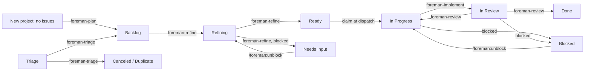

# Foreman

[](https://github.com/andyhite/foreman/actions/workflows/ci.yml)

An [omp](https://github.com/andyhite/oh-my-pi) plugin that runs a
single-operator agile SDLC over [Linear](https://linear.app). Agents move
issues one state to the right; you approve what they propose.

Foreman keeps no database. Linear is the state machine, the queue, and the
audit log: every agent decision lands as a Linear mutation or comment, so the
board you already look at is the whole system state.

## The shape of it



| Agent | Edge | Model | Produces |
| --- | --- | --- | --- |
| `foreman-triage` | Triage → Backlog / Canceled / Duplicate | `@default` | A priority, a `type:` label, dedupe findings |
| `foreman-roadmap` | Initiative brief → sequenced projects | `@plan` | Projects with dependency edges and start/target dates |
| `foreman-plan` | New project (zero issues) → Backlog | `@plan` | A first slate of draft issues from the project brief |
| `foreman-refine` | Backlog → Ready | `@plan` | Acceptance criteria, a Fibonacci estimate, a split proposal |
| `foreman-implement` | In Progress → In Review | `@default` | A branch, tests, a PR, per-criterion evidence |
| `foreman-review` | In Review → Done / In Progress | `@slow` | Findings by severity against the diff |
| `foreman-context` | Team's product `Context` doc, in place — no issue or project transition | `@plan` | Proposed decisions, vocabulary, non-goals; the Definition of Done stays operator-only |

Seven agents, one edge each (`foreman-context` updates the team's `Context`
doc in place instead of moving an issue or project). An agent returns a
validated structured result;
the extension performs the mutation. That split is the design:

- No agent can spawn another: the `task` tool is withheld.
- No agent can write to Linear: no write tool, and the loop scrubs every
  `LINEAR_*` environment variable from a dispatched agent's environment on
  both dispatch paths (`omp -p` print mode and the herdr pane), so the key
  stays out of `ps`/`env` dumps and out of anything the agent spawns.
  Residual exposure: loop dispatch requires `linear.apiKeyFile` precisely so
  the dispatched agent's own extension can read the credential from disk,
  and every agent holds `read` (implement also holds `bash`), so any agent
  in that session can read `~/.foreman/linear-api-key` and, where
  configured, `~/.foreman/github-app-private-key.pem` — whose installation
  tokens can approve PRs. This is defense in depth, not a sandbox; issue
  content is untrusted input.
- A loop-dispatched deployment therefore requires `linear.apiKeyFile`. Both
  dispatch paths (`packages/loop/src/dispatch/print.ts`, `packages/loop/src/dispatch/herdr.ts`)
  scrub `apiKeyEnv`, and the dispatched session's own extension still needs
  a write-capable client to claim locks and apply results. An env-var-only
  deployment cannot support loop dispatch.

Sequence is native Linear relations, never dates or reading order:
`foreman-roadmap` wires `dependency` edges between projects,
`foreman-plan` wires `blocks` edges between the issues it drafts. The loop
reads them back as gates: a project with an unshipped prerequisite is not a
planning candidate; an issue with an open blocker is neither refined nor
implemented.

An agent that cannot proceed neither guesses nor stalls. It yields a
`BlockRecord` naming the question and the options, which becomes a
`blocked:*` label and an entry in the queue you drain with one keypress.

## Install

Requires [Bun](https://bun.sh) 1.3+, `git`, `gh` authenticated for the repos
Foreman will open PRs against, and [omp](https://github.com/andyhite/oh-my-pi).
Foreman is not published as a package: the CLI comes from a clone-and-build,
after which one global symlink points every registered repo at that checkout.

1. **Get the checkout and run `foreman setup`.** One-liner:

   ```bash
   curl -fsSL https://raw.githubusercontent.com/andyhite/foreman/main/scripts/install.sh | bash
   ```

   It clones to `~/.foreman/src`, builds, drops a `foreman` wrapper on
   `$PATH` (`~/.local/bin` by default), and launches `foreman setup`. Extra
   arguments pass through to `setup` (`... | bash -s -- --yes`). Re-running
   pulls, rebuilds, and re-runs setup over your existing config. By hand:

   ```bash
   git clone https://github.com/andyhite/foreman
   cd foreman
   bun install && bun run build
   bun run packages/cli/dist/main.js setup --yes
   ```

2. **Register each repo with `foreman init`, inside that repo.**

   ```bash
   cd ~/Code/my-app
   foreman init
   ```

3. **Bring a machine current later with `foreman update`.** Never re-run the
   installer or a bare `git pull` for this.

### `foreman setup` (once per machine)

Checks for `bun`/`git`/`gh`/`omp`/`herdr`, walks you through the Linear API
key, and writes one symlink: `~/.foreman/plugin -> <checkout>/packages/omp-plugin`.
It never touches repos, initiatives, or teams, and never activates the plugin
anywhere; that is `foreman init`'s job.

Key handling: `$LINEAR_API_KEY` already set → prompt skipped, nothing
validated against Linear (runtime resolves the key the same way), and the
key is written to `~/.foreman/linear-api-key` anyway so loop dispatch (which
scrubs `LINEAR_*` env vars from the dispatched agent) can still read it. No
key or no network → setup writes none; set `$LINEAR_API_KEY` or
`linear.apiKeyFile` before starting the loop. A pasted key always goes to
`~/.foreman/linear-api-key`, mode `0600`.

| Flag | Does |
| --- | --- |
| `--link` | Symlink `foreman` to a wrapper that execs this checkout's TypeScript source via `bun`; edits take effect with no rebuild. CLI dev mode only; unrelated to the plugin link. |
| `--checkout <path>` | Checkout to link (default: auto-detect this one). |
| `--skip-linear` | Skip the key prompt. |
| `--home <path>` | Home directory for `~/.foreman` (test hook). |
| `-y`, `--yes` | Accept every default non-interactively. |

### `foreman init` (once per repo)

Resolves the repo root (`git rev-parse --show-toplevel`), then:

1. Asks for the Linear team this repo binds to (a select over the
   workspace's teams, pre-selecting one already bound to this path), then
   the apps hosted in this repo (comma-separated, blank for a single-app
   repo).
2. Writes the registry entry (alias, path, team, apps) to
   `~/.foreman/config.json`. You confirm or edit every choice before it is
   written.
3. Writes `<repo>/.omp/plugins/omp-plugins.lock.json` and
   `<repo>/.omp/plugins/node_modules/@foreman/omp-plugin` (a symlink to
   `~/.foreman/plugin`), plus a `.git/info/exclude` line so neither shows in
   `git status`. `--skip-plugin` skips this step.
4. Provisions the repo's Linear team: enables Triage, disables Cycles,
   creates the nine managed workflow states, creates `app:*` labels for the
   repo's apps, and seeds the product `Context` doc. Confirmed once with an
   itemized list of every change before anything is written, and
   auto-approved under `--yes` — except archiving a workflow state Foreman
   does not manage, which `--yes` always skips and reports rather than
   applying. `foreman deinit --revert-linear` reverts the workflow states
   this step created.

`foreman init` never prompts for or writes the Linear API key.

| Flag | Does |
| --- | --- |
| `--app <name>` | App in this repo; repeat for a monorepo. |
| `--alias <name>` | Registry alias override (default: derived from the repo directory name). |
| `--team <KEY>` | Linear team for this repo. Required when run non-interactively (`--yes` or no TTY) and no team is already bound to this repo. |
| `--skip-linear` | Skip Linear API access (team provisioning is skipped too). |
| `--skip-plugin` | Register only; leave `.omp/plugins/` alone. |
| `--path <dir>` | Register a directory other than the current one. |
| `-y`, `--yes` | Accept every default non-interactively. Fails with an error if `--team` is also omitted and no team is already bound to this repo. |

The resulting entry:

```json
{
  "repos": {
    "my-app": {
      "path": "~/Code/my-app",
      "team": "ENG",
      "apps": [{ "name": "fleet" }]
    }
  },
  "linear": {
    "apiKeyEnv": "LINEAR_API_KEY"
  }
}
```

The `repos` registry, keyed by alias, is the single table binding a repo to
a Linear team and the apps it hosts; a monorepo lists several apps on one
entry. The key resolves from `$LINEAR_API_KEY`, else `linear.apiKeyFile`.

### `foreman deinit`, `foreman doctor`, `foreman update`

- `foreman deinit` (inside a repo) removes the plugin lock and symlink under
  `.omp/plugins/` and, unless `--keep-registry`, drops the repo's registry
  entry. `--path <dir>` targets another directory. `--revert-linear`
  archives the empty workflow states `foreman init` created on the repo's
  Linear team (a state still holding issues is left alone and reported);
  Foreman has no delete for the `app:*`/`type:*` labels, the team's
  triage/cycles settings, or the Context doc, so those are always left in
  place and named in the output.
- `foreman doctor` checks the global plugin link and every registered repo's
  activation; a broken symlink or stale lock entry is a problem. `--fix`
  repairs what it can — re-runs the equivalent of `activateRepoPlugin` per
  affected repo, and re-provisions each repo's Linear team (workflow
  states, `app:*` issue/project labels). The Linear repair prompts for
  confirmation unless `--yes` is also passed; with neither `--yes` nor a
  terminal to prompt on, it is skipped and reported rather than applied.
  `--checkout <path>` overrides the expected checkout. Exits `0` when
  healthy, `1` when problems remain.
- `foreman update` pulls the checkout and rebuilds the CLI. The plugin loads
  from source, so that is the entire update; every registered repo follows
  the global link with no per-repo work. Flags: `--checkout <path>`,
  `--skip-pull` (rebuild only), `--skip-plugin` (leave the global link
  alone), `--home <path>`.

**Old machine-wide install?** Earlier `foreman setup` registered an omp
marketplace and installed the plugin user-scoped, so it loaded in every omp
session. `foreman doctor` detects the leftover; `foreman doctor --fix`
removes it. Then `foreman init` in each repo that should have Foreman.

## Running the loop

Order of operations: `setup` once per machine, `init` once per repo,
`update` when Foreman changes upstream. Three loops run per repo:

```bash
foreman plan [alias] [--once] [--mode confirm|yolo] [--dispatcher auto|print|herdr] [--poll <seconds>]
foreman build [alias] [--once] [--mode confirm|yolo] [--dispatcher auto|print|herdr] [--poll <seconds>]
foreman reconcile [alias] [--mode confirm|yolo] [--dry-run]
```

`foreman plan` runs triage/plan/refine; `foreman build` runs
implement/review/merge. `--once` runs a single poll, dispatches whatever is
eligible, waits for it, then exits — the way to drive either loop by hand or
from a scheduler. `--dispatcher` picks how an agent is spawned (`auto`
prefers `herdr` when available, falling back to `print`). `foreman reconcile`
repairs Linear drift a stopped or crashed loop can leave behind — an
orphaned `foreman:running` lock, an abandoned in-progress issue, a merged PR
whose issue never moved to Done, an `In Review` issue with no PR and an
unpushed branch, or a `foreman:blocked` issue the operator already answered.
`--dry-run` logs every invariant's fix without applying it or prompting.

`loop.mode` (overridable with `--mode`) defaults to `confirm`: every loop
asks before every Linear mutation and every dispatch; `confirm` needs a TTY,
and a run with no terminal attached refuses to start rather than declining
silently.

Dispatching an agent requires `linear.apiKeyFile`: the loop scrubs every
`LINEAR_*` environment variable from a dispatched agent's process, so an
`$LINEAR_API_KEY`-only setup cannot pass the credential through and every
loop refuses to start with a `loop dispatch requires linear.apiKeyFile`
error. Run `foreman setup` to write the key to `~/.foreman/linear-api-key`
and set `linear.apiKeyFile` to it. `foreman reconcile` is exempt from this
check — it applies fixes directly through the Linear client and never
dispatches an agent.

Every dispatch settle prints one line naming the issue, the agent, ✓ or ✗,
and how long it ran, and — when the dispatcher captured a transcript —
writes it to `~/.foreman/state/<alias>/logs/<dispatch-id>.log` and names
that path on the line. Repeated idle polls collapse to a single summary
line instead of one per poll. `--once` exits non-zero if any dispatch in
that run failed, so a scheduler can tell a bad run from a quiet one.


## Operator surface

Slash commands inside any omp session:

| Command | Does |
| --- | --- |
| `/foreman:triage` | Classify, prioritize, and route a batch of Inbox items. `<ISSUE-ID>...` |
| `/foreman:roadmap` | Decompose the repo's team into its next slate of projects. `[DOCUMENT-PATH]` |
| `/foreman:context` | Propose edits to the team's product `Context` doc (decisions, vocabulary, non-goals). Operator-invoked only. |
| `/foreman:plan` | Seed a bare project's first Backlog issues. `<PROJECT-ID>...` |
| `/foreman:refine` | Refine prioritized issues to Ready. `<ISSUE-ID>...` |
| `/foreman:implement` | Implement one ready issue and open its PR. `<ISSUE-ID>` |
| `/foreman:review` | Cold-review in-review diffs. `<ISSUE-ID or PR>...` |
| `/foreman:status` | Operator console: queue depth, blocked queue, in-flight locks, and loop state. |
| `/foreman:merge` | Merge one issue's PR (or branch) once the review gate passes. `<ISSUE-ID>`. Operator-invoked only. |
| `/foreman:unblock` | Record your reply to a blocked issue and return it to Backlog or Ready. `<ISSUE-ID> <reply>` |

## Development

```bash
git clone https://github.com/andyhite/foreman
cd foreman
bun install && bun run build
bun run setup          # setup --link, straight from source
```

```bash
bun run typecheck      # tsc --build --force across the workspace
bun test
bun run contract       # agent/skill/schema wiring check
bun run schemas        # regenerate output schemas into agent frontmatter
bun run check          # typecheck + test + contract + build
bun run check:ci       # check, plus the CI mirror: bun audit, CLI smoke test,
                        # install.sh syntax check, schema regen with a clean diff
```

The plugin has no build step: `omp.extensions` names `./src/extension.ts`
directly, so a plugin source change just needs a commit. See
`packages/omp-plugin/README.md` for the plugin's layout and editing rules,
and `AGENTS.md` for the conventions agents working on this repo follow.
