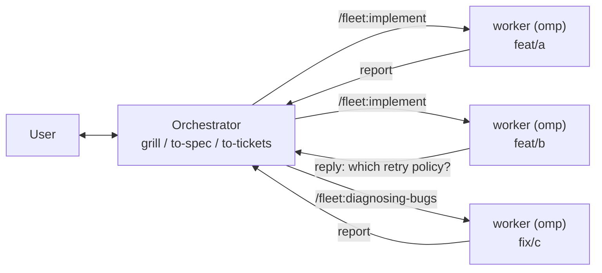

# Foreman

Foreman is a repo with two Fleet plugins that let one agent act as a project
manager and hand the actual engineering to peer agents running on their own
branches:

- **[`herdr/`](./herdr/)** — a herdr plugin providing the `fleet` CLI: create a
  git worktree, start a separate coding agent in it, dispatch work, collect the
  report.
- **the repo root** — an omp-native agent plugin (`package.json`,
  `.omp-plugin/plugin.json`, `commands/`, `skills/`, `extension/`) providing
  the orchestrator's slash commands and custom tools, each of which dispatches
  the matching [mattpocock/skills](https://github.com/mattpocock/skills) skill
  to a worker.

Both plugins are named `fleet`; the repo is named `foreman` on GitHub for
where they live, not for any marketplace semantics — there isn't one.

## The idea

omp's `task` subagents share one process: one context window, one working
directory, one lifetime. That is the right tool for work that fits in the
current checkout, and the wrong one for anything that wants a branch.

herdr already has the primitives for the other case — worktrees, panes, named
agents you can address later — and `fleet` is those primitives wired into one
command per dispatch. A worker is a full omp process with its own context
window, sitting in its own worktree, reachable an hour later, and its
deliverable is a branch rather than a message.

On top of that, the mattpocock skills split along a line worth taking seriously:

|  | needs the user in the room | needs only a checkout |
|---|---|---|
| | `grill-me`, `grill-with-docs`, `to-spec`, `to-tickets`, `triage`, `wayfinder` | `implement`, `diagnosing-bugs`, `research`, `prototype`, `code-review` |
| runs | in seconds, interactively | for a long time, autonomously |
| wants | your attention | a branch |

Run both halves in one session and the long half blocks the interactive half.
So the orchestrator keeps the left column — it interviews, specs, and slices —
and every item in the right column is dispatched to a worker with a brief that
starts with an instruction to read `skill://implement` and follow it.

That explicit line is what keeps a worker on the one skill named for it. The
same discipline applies on your side of the split: the left-column skills all
carry `disable-model-invocation: true`, so they do not show up in a skill menu
either — you invoke them explicitly by name rather than waiting for the model
to offer them.



## Requirements

- [herdr](./herdr/) 0.8.0 or newer, and a herdr pane (`HERDR_ENV=1`)
- `jq` on `PATH`
- [mattpocock/skills](https://github.com/mattpocock/skills) installed at a
  standard omp Agent Skills root, so `skill://implement` and friends resolve
- macOS or Linux

## Install

Both halves are needed: the herdr plugin supplies the mechanism, the agent
plugin supplies the commands and custom tools.

```sh
herdr plugin install andyhite/foreman/herdr
```

```sh
omp install github:andyhite/foreman
```

For a local checkout instead of GitHub, either command takes a path:

```sh
herdr plugin link ./herdr
omp install ./
```

Installing the omp plugin also registers the `fleet_*` custom tools. Restart
the session afterward — omp loads extension modules at startup, not
mid-session.

## Use

```
/fleet:foreman Ship the webhook retry work in #412 and #413
```

That claims an orchestrator handle for the pane and adopts the role. From
there the orchestrator interviews you, slices the objective, and dispatches
one command per kind of work:

| Command | Worker skill | For |
|---|---|---|
| `/fleet:implement` | `implement` | building a spec or set of tickets |
| `/fleet:diagnosing-bugs` | `diagnosing-bugs` | a bug or performance regression |
| `/fleet:research` | `research` | a question needing primary sources |
| `/fleet:prototype` | `prototype` | a design question needing something runnable |
| `/fleet:code-review` | `code-review` | reviewing a branch a worker already produced |

Every dispatch command does the same three things: check that you can state
the requirements precisely, write a brief to a file, and dispatch a worker
against it (the `fleet_spawn` tool, or `fleet spawn` on the CLI — they are the
same operation). What differs is *which* requirements that skill cannot
proceed without — the seams the `tdd` skill will test at, the reproduction
steps a feedback loop needs, the fixed point a review diffs against.

The spawn is always this shape:

```bash
fleet spawn <branch> --tier <standard|deep> \
  --skill <execution-skill> --task-file <brief>
```

`--skill` prepends one universal instruction — `Before doing any other work,
read skill://<name> and follow it.` — so there is one invocation path for
every worker, because every worker is omp: no per-kind syntax to keep in sync.
Fleet then appends its protocol block telling the worker how to commit, file
its report, stay in its worktree, and interrupt the orchestrator with a
question. Briefs repeat neither the skill instruction nor the protocol.

When the work is already in the tracker rather than in the conversation, one
command does the whole loop:

```
/fleet:backlog wave 1
```

It walks the tracker's dependency graph, dispatches the ready frontier to the
skill each ticket calls for, sends every branch that comes back to a review
worker, merges what passes, then recomputes and dispatches again. Merging is
the part that makes it a loop — a dependent ticket reaches the frontier only
when its blocker closes. It reads `docs/agents/issue-tracker.md` and cannot
run without it; read `skill://setup-matt-pocock-skills` once per repo to
create it.

## Invocation control

omp loads `commands/` and `skills/` through the same machinery, so both are
invocable from both sides unless the frontmatter says otherwise. The two
halves want opposite defaults:

| File | Frontmatter | User | Model |
|---|---|---|---|
| `commands/*.md` | `disable-model-invocation: true` | yes | no |
| `skills/*/SKILL.md` | `user-invocable: false` | no | yes |

A dispatch command creates a branch, a worktree, and a live agent process —
a side effect a user asks for, never one a model should decide on its own, so
every command opts out of model invocation.

The two skills are the opposite: contract documents, meant to be read.
`fleet` would otherwise bind bare `/fleet` beside the `fleet:` command
namespace, which is noise, so they opt out of user invocation and stay
reachable to a model — and to any session through `skill://fleet`, which
reads the file directly and ignores both fields.

## Skills

- `skill://fleet-dispatch` — the orchestrator/worker split and brief shape
- `skill://fleet` — spawning, joining, replying, reporting, and reaping

Details: [`herdr/README.md`](./herdr/README.md) for the CLI.
