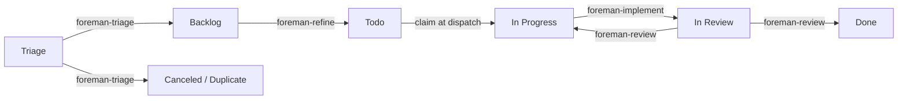

# Foreman

[](https://github.com/andyhite/foreman/actions/workflows/ci.yml)

An [omp](https://github.com/andyhite/oh-my-pi) plugin that runs a single-operator
agile SDLC over [Linear](https://linear.app). Agents move issues one state to the
right; you approve what they propose.

Foreman keeps no database. Linear is the state machine, the queue, and the audit
log. Every decision an agent makes lands as a Linear mutation or a comment, so
the board you already look at is the whole system state.

## The shape of it



Four workflow agents, each responsible for exactly one edge. None of them can
spawn another agent, and none of them can write to Linear — the `task` tool and
Linear's mutation API are both withheld. An agent returns a validated structured
result; the extension performs the mutation. That split is the design.

| Agent | Edge | Model | Produces |
| --- | --- | --- | --- |
| `foreman-triage` | Triage → Backlog / Canceled / Duplicate | `@smol` | A priority, a `type:` label, dedupe findings |
| `foreman-refine` | Backlog → Todo | session | Acceptance criteria, a Fibonacci estimate, a split proposal |
| `foreman-implement` | In Progress → In Review | session | A branch, tests, a PR, per-criterion evidence |
| `foreman-review` | In Review → Done / In Progress | `@slow` | Findings by severity against the diff |

An agent that cannot proceed does not guess and does not stall. It yields a
`BlockRecord` naming the question and the options, which becomes a `blocked:`
label and an entry in the drain you resolve with one keypress.

## Install

Requires [Bun](https://bun.sh) 1.3+, `git`, `gh` authenticated for the repos
Foreman will open PRs against, and [omp](https://github.com/andyhite/oh-my-pi).
Foreman isn't published as a standalone package, so getting the CLI still means
a one-time clone-and-build — after that, `foreman setup` registers the plugin
straight from GitHub and none of your other repos need this checkout again.

The one-line installer clones the checkout to `~/.foreman/src`, builds it,
drops a `foreman` wrapper on `$PATH` (`~/.local/bin` by default), and launches
`foreman setup`:

```bash
curl -fsSL https://raw.githubusercontent.com/andyhite/foreman/main/scripts/install.sh | bash
```

It's re-runnable — running it again pulls the latest checkout and re-runs
setup on top of your existing `~/.foreman/config.json`. Extra arguments pass
straight through to `foreman setup`, e.g.
`... | bash -s -- --yes --omp install --scope user`. Prefer to do it by hand:

```bash
git clone https://github.com/andyhite/foreman
cd foreman
bun install && bun run build
bun run packages/cli/dist/main.js setup --yes --omp install --scope user
```

`foreman setup` is the one-time-per-machine installer: it checks for
`bun`/`git`/`gh`/`omp`/`herdr`, walks you through the Linear API key, and
installs the plugin(s) you choose. It never touches repos, initiatives, or
teams — that's `foreman init`'s job (below), run once per repo instead. If
`$LINEAR_API_KEY` is already set, setup skips the key prompt entirely and
uses it straight away to confirm you're pointed at the right workspace;
without a key (or without network access to Linear), setup falls back to a
manual prompt for where to store one. `--omp install` (shown above) is the
production path — it registers the omp plugin from `andyhite/foreman` on
GitHub rather than linking back to this checkout. Drop `--yes` to be walked
through the prompts interactively instead:

`--scope user` (the default) installs the omp plugin across every repo you
work in; `--scope project` scopes it to the current repo. The herdr board is
optional — add `--herdr install` to register it too, or answer its prompt.
Run `setup --help` for the full flag list, including `--repo-source` to point
at a fork. `setup` without `--yes` is equivalent to running these by hand:

```bash
omp plugin marketplace add andyhite/foreman
omp plugin install foreman@foreman --scope user
```

Once setup has run, register each repo Foreman will manage by running
`foreman init` **inside that repo**:

```bash
cd ~/Code/my-app
foreman init
```

`foreman init` resolves the repo root with `git rev-parse --show-toplevel`,
then lists every product (initiative) in your Linear workspace as a checkbox
picker (`↑`/`↓` to move, `space` to toggle, `enter` to confirm) — pre-checking
any already mapped to this repo — and asks for the team and alias. You
confirm or edit every choice before it's written to `~/.foreman/config.json`.
`--skip-linear` takes manual initiative ids instead of querying the API;
`--path <dir>` registers a directory other than the current one; `-y`/`--yes`
accepts every default and pre-checked value non-interactively; `--home
<path>` overrides `~/.foreman` for testing. `foreman init` never prompts for
or writes the Linear API key — that's `foreman setup`'s job.

`foreman init` writes an entry like this to `~/.foreman/config.json`'s
`repos` table — or edit it directly:

```json
{
  "repos": {
    "my-app": {
      "path": "~/Code/my-app",
      "initiatives": ["a1b2c3d4-0000-0000-0000-000000000000"]
    }
  },
  "linear": {
    "apiKeyEnv": "LINEAR_API_KEY"
  }
}
```

Foreman reads the Linear personal API key from `$LINEAR_API_KEY`, or from
`linear.apiKeyFile` when the env var is unset — `foreman setup` writes that file
for you (mode `0600`) if you paste a key during the prompt. The `repos`
registry, keyed by alias, is the single table binding a repo to a team and the
initiatives it hosts, each entry written by one `foreman init` run; an issue
whose project has no initiative, or whose initiative isn't bound to any
entry, is skipped rather than guessed at. A monorepo lists several
initiatives on one entry.

Order of operations: `foreman setup` once per machine, `foreman init` once
per repo, then Foreman is **one `foreman loop` instance per repo**: run
`foreman loop [--repo <alias>] [--team <KEY>]` inside each Foreman-managed
repo — the instance's entry resolves by matching cwd against registry paths,
or `--repo` overrides. The shared Triage inbox is consumed separately, by one
team-level `foreman intake [--team <KEY>]` process — not by any loop
instance.

Once installed, day-to-day use is `foreman loop` (below) and the `/foreman:*`
slash commands inside any omp session. See [Development](#development) below
if you want to hack on Foreman itself instead of just running it.

## Running the loop

The supervisor polls Linear and dispatches whatever the gates allow.

```bash
foreman loop --dry-run --once --verbose   # decide and log, dispatch nothing
foreman loop --stage read-only            # comment and label, no code
foreman loop --stage full                 # the whole pipeline
```

`loop.stage` defaults to `dry-run`, so a loop started before you are ready logs
its intentions instead of acting on them. A dry run prints one line per skip with
the gate that refused:

```
[foreman-loop] refine: 0 dispatched, 43 skipped
[foreman-loop]   skip refine PLT-21: unprioritized — Priority is None.
[foreman-loop]   skip implement ENG-9: backpressure — team-wide blocked depth at threshold.
```

The `foreman-loop` prefix names the long-lived process, not the command — the
same spelling herdr uses for its pane. The loop is a singleton: a second one
refuses to start while the first holds the lock.

## Operator surface

Slash commands, inside any omp session:

| Command | Does |
| --- | --- |
| `/foreman:status` | Board state, WIP, backpressure, last run per worker |
| `/foreman:apply` | Review staged proposals; `--yes` to execute the batch |
| `/foreman:apply ENG-1 --approve` | Accept one proposal |
| `/foreman:apply ENG-1 --reject <reason>` | Reject one, with the reason recorded |
| `/foreman:merge` | Merge what is mergeable, then move issues to Done |
| `/foreman:unblock ENG-1 <reply>` | Answer a `BlockRecord` and release the issue |

Four dispatch commands run one agent by hand: `/foreman:triage`,
`/foreman:refine`, `/foreman:implement`, `/foreman:review`.

If you use [herdr](https://github.com/andyhite/herdr), the board ships as a
plugin with four screens — the blocked drain, proposal review, the board, and
live agent detail. Requires herdr 0.8.0 or newer. `foreman setup --herdr install`
installs it from GitHub; by hand:

```bash
herdr plugin install andyhite/foreman/packages/herdr-plugin
```

(See [Development](#development) for `herdr plugin link` — the dev-mode path.)

Installing registers four actions and, via its `[[startup]]` hook, ensures a
long-lived `foreman-loop` pane in a workspace labelled `foreman` — reusing yours
if you already have one. Bind the screens you want in
`~/.config/herdr/config.toml`; an action is the only thing a keybinding can
address, so each screen is reached through one:

```toml
[[keys.command]]
key = "ctrl+shift+b"
type = "plugin_action"
command = "andyhite.foreman.open-blocked"
description = "Foreman: open the blocked drain"
```

The other three are `open-proposals`, `open-board`, and `open-agents`. To run
agents in real panes you can attach to instead of headless children, set
`loop.dispatcher` to `"herdr"`; if the server is unreachable the loop logs a
fallback and continues in print mode rather than stalling.

## Configuration

`~/.foreman/config.json` holds everything — one global file, no per-repo
config. Defaults are chosen so that an empty config is a safe config.

| Key | Default | Meaning |
| --- | --- | --- |
| `loop.stage` | `dry-run` | Autonomy rung: `dry-run`, `read-only`, `full` |
| `loop.wipGlobal` | `3` | Hard cap on concurrent agents, per instance |
| `loop.wip` | `2/3/2` | Per-stage caps: refine, implement, review (triage is not a loop worker) |
| `loop.backpressureThreshold` | `5` | Team-wide blocked depth at which all dispatch stops |
| `loop.readyBufferTarget` | `5` | How deep refine keeps the Todo buffer |
| `loop.reviewCycleCap` | `2` | Review round trips before it escalates to you |
| `intake.window` | `06:00` | When the daily intake batch may start |
| `loop.cadenceMinutes` | `5` | Poll interval |
| `repoDefaults.pr.required` | `true` | Open a PR rather than pushing to the base branch |
| `repoDefaults.merge.strategy` | `squash` | `merge`, `squash`, or `rebase` |
| `agent.maxRuntimeMs` | `7200000` | Mirrors omp's cap; the lock TTL derives from it |

Config tunes parameters. It never removes an invariant: there is no key that
disables a gate, a WIP limit, backpressure, the lock protocol, or
propose-before-apply.

## Labels

Foreman reads and writes a small vocabulary, and every label in it is consumed by
a gate or a worker predicate.

- `type:` — `bug`, `feature`, `chore`, `spike`, `docs`. Required to leave Triage.
- `agent:` — `ready`, `running`, `proposed`, `hands-off`. Lifecycle control,
  written only by the extension. `agent:hands-off` is yours: it means no agent
  touches this issue.
- `blocked:` — `needs-input`, `needs-decision`, `external`. The interrupt queue.

## Layout

```
packages/
  core/          Linear client, config, gate validators, lock protocol, schemas
  omp-plugin/    The plugin: agents, skills, commands, rules, extension
  loop/           The supervisor and its six workers
  herdr-plugin/   The board: four TUI panes over the same core
  cli/            The foreman CLI — setup, init, and delegates `loop` to packages/loop
```

`packages/core` is the single source of truth for every contract. The four agent
output schemas are defined once in TypeBox there and generated into each agent's
frontmatter — CI fails if the two drift.

## Development

Same clone as above, but link instead of install: `foreman setup --omp link`
symlinks `packages/omp-plugin` in place so edits show up without reinstalling,
and `--herdr link` does the same for `packages/herdr-plugin`.

```bash
git clone https://github.com/andyhite/foreman
cd foreman
bun install && bun run build
bun run setup
```

`bun run setup` runs `setup --omp link --herdr link` straight from source
(no prebuilt `@foreman/cli` needed); everything after `setup` still prompts,
so it's the same tool-preflight-and-Linear-key walkthrough as the top-level
install, just wired to link both plugins back to this checkout instead of
installing from GitHub. Run `bun run packages/cli/src/main.ts init` inside
each repo you want to register, same as with a built CLI.

`omp plugin link` and `herdr plugin link` register the checkout but skip its
build step, so every source change needs `bun run build` (or `bun run --filter
'@foreman/omp-plugin' build`/`--filter '@foreman/herdr-plugin' build` for one
package) before `/reload-plugins` or a herdr restart picks it up. `foreman`
itself is a bundled CLI too — rebuild `@foreman/cli` the same way after editing
`packages/cli`, or run it straight from source with `bun run packages/cli/src/main.ts`.

```bash
bun run typecheck   # tsc --build across the workspace
bun test            # 268 tests
bun run contract    # agent/skill/schema wiring check
bun run schemas     # regenerate output schemas into agent frontmatter
bun run check       # all three
```

`bun run contract` catches the failures that are silent at runtime: a tool name
omp does not have, an `autoloadSkills` entry with no matching skill, a skill
shadowed by a higher-priority provider, or a frontmatter schema that has drifted
from its TypeBox definition. None of these produce a warning when omp loads the
plugin; the agent just runs without its procedure.

## Documentation

- [`docs/SPEC.md`](docs/SPEC.md) — the build specification this implements
- [`docs/VERIFIED.md`](docs/VERIFIED.md) — what was measured against the real omp,
  herdr, and Linear APIs during the build, including the four places the spec was
  wrong and what the code does instead
