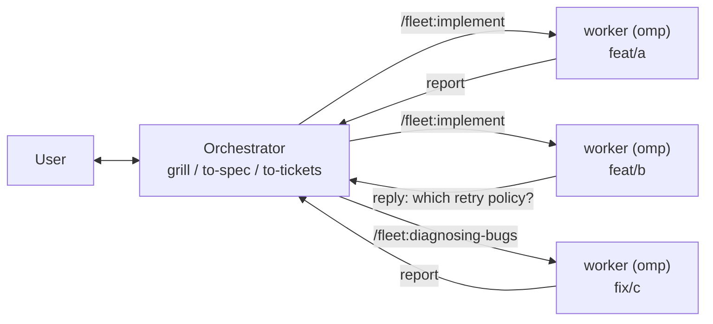

# Foreman

Foreman is the marketplace. **Fleet** is what it publishes: two plugins that let
one agent act as a project manager and hand the actual engineering to peer agents
running on their own branches.

- **[`herdr/`](./herdr/)** — a herdr plugin providing the `fleet` CLI: create a
  git worktree, start a separate coding agent in it, dispatch work, collect the
  report.
- **[`plugins/fleet/`](./plugins/fleet/)** — an omp-native agent plugin
  providing the orchestrator's slash commands and custom tools, each of which
  dispatches the matching
  [mattpocock/skills](https://github.com/mattpocock/skills) skill to a worker.

Both plugins are Fleet; the marketplace is named for the repository that
publishes them. That is why the install target below reads `fleet@foreman`.

## The idea

omp's `task` subagents share one process: one context window, one working
directory, one lifetime. That is the right tool for work that fits in the
current checkout, and the wrong one for anything that wants a branch.

herdr already has the primitives for the other case — worktrees, panes, named
agents you can address later — and `fleet` is those primitives wired into one
command per dispatch. A worker is a full omp process with its own context
window, sitting in its own worktree, reachable an hour later, and its
deliverable is a branch rather than a message.

On top of that, the mattpocock skills split along a line worth taking seriously:

|  | needs the user in the room | needs only a checkout |
|---|---|---|
| | `grill-me`, `grill-with-docs`, `to-spec`, `to-tickets`, `triage`, `wayfinder` | `implement`, `diagnosing-bugs`, `research`, `prototype`, `code-review` |
| runs | in seconds, interactively | for a long time, autonomously |
| wants | your attention | a branch |

Run both halves in one session and the long half blocks the interactive half.
So the orchestrator keeps the left column — it interviews, specs, and slices —
and every item in the right column is dispatched to a worker with a brief that
starts with an instruction to read `skill://implement` and follow it.

That explicit line is what keeps a worker on the one skill named for it. The
same discipline applies on your side of the split: the left-column skills all
carry `disable-model-invocation: true`, so they do not show up in a skill menu
either — you invoke them explicitly by name rather than waiting for the model
to offer them.



## Install

Both halves are needed: the herdr plugin supplies the mechanism, the agent plugin
supplies the commands and custom tools.

```sh
herdr plugin install andyhite/foreman/herdr
```

```
/marketplace add andyhite/foreman
/marketplace install fleet@foreman
```

Installing `fleet@foreman` also registers the `fleet_*` custom tools. Restart
the session afterward — omp loads extension modules at startup, not mid-session.

You also need [mattpocock/skills](https://github.com/mattpocock/skills)
installed at a standard omp skill root so that `skill://implement` and
friends resolve, and `jq` on your PATH.

## Use

```
/fleet:boss Ship the webhook retry work in #412 and #413
```

That claims an orchestrator handle for the pane and adopts the role. From there
the orchestrator interviews you, slices the objective, and dispatches:

Every dispatch command is named for the skill it delegates to, so the slash menu
tells you where the work is going:

`/fleet:implement` · `/fleet:diagnosing-bugs` · `/fleet:research` ·
`/fleet:prototype` · `/fleet:code-review`

Each one spawns a worker whose brief opens with an instruction to read
`skill://<that same name>` and follow it.

When the work is already in the tracker rather than in the conversation, one
command does the whole loop:

```
/fleet:backlog wave 1
```

It walks the tracker's dependency graph, dispatches the ready frontier to the
skill each ticket calls for, sends every branch that comes back to a review
worker, merges what passes, then recomputes and dispatches again. Merging is the
part that makes it a loop — a dependent ticket reaches the frontier only when its
blocker closes.

Details: [`herdr/README.md`](./herdr/README.md) for the CLI,
[`plugins/fleet/README.md`](./plugins/fleet/README.md) for the commands.
