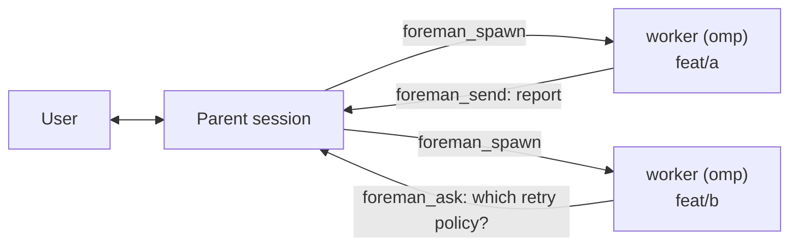

# Foreman

Foreman lets one agent act as a project manager and hand engineering work to
peer agents, each running on its own git worktree and branch. It is a single
omp-native agent plugin — one extension (`extension/index.ts`) exposing five
tools, `foreman_spawn`, `foreman_send`, `foreman_ask`, `foreman_ls`,
`foreman_reap` — identical in every session. There is no bash CLI, no MCP
sidecar, and no slash commands; the tools are the whole interface.

## The idea

omp's `task` subagents share one process: one context window, one working
directory, one lifetime. That is the right tool for work that fits in the
current checkout, and the wrong one for anything that wants a branch.

A worker spawned by `foreman_spawn` is instead a full omp process with its
own context window, sitting in its own git worktree, reachable an hour
later, and its deliverable is a branch rather than a message. Foreman
manages the worktrees, branches, workers, and reports, and has no opinion on
*how* a worker does its job — it ships no execution skills of its own. If a
worker should follow a particular procedure, name it in the brief, the same
way you'd tell a stranger what to do.



Every session carries the same five tools — there is no boss mode or worker
mode. "Parent" and "worker" are just names for the two ends of a spawn edge:
whoever calls `foreman_spawn` is the parent, the session it creates is the
child. A child that spawns children of its own is a parent on one edge and a
child on another, with no extra concept. `foreman_ask` always goes to your
own parent; worker-to-worker messaging is out of scope by construction, not
policy. See [docs/ARCHITECTURE.md](./docs/ARCHITECTURE.md) for the full
design rationale.

## Requirements

- [herdr](https://github.com/andyhite/herdr), and a herdr pane
  (`HERDR_ENV=1`) — worktree panes are how workers get a terminal
- A git repository
- macOS or Linux

## Install

```sh
omp install github:andyhite/foreman
```

For a local checkout instead of GitHub:

```sh
omp install ./
```

Restart the session after installing; extension modules load only at
startup, so `/mcp reconnect` or similar is not enough.

## Use

From a parent session, spawn a worker onto a fresh branch and worktree with
its first task:

```
foreman_spawn(handle: "webhooks", branch: "feat/webhook-retry",
  brief: "Add exponential backoff to the webhook dispatcher in
  lib/webhooks/dispatch.ts. Tests in tests/webhooks/. Do not change the
  public dispatch() signature.")
```

The worker starts with no conversation history — the brief is its entire
context. `base` is optional and defaults to the parent's current HEAD.

- `foreman_send` — message a handle on one of your edges (your parent, or a
  worker you spawned). Covers dispatching a new task, a follow-up, and a
  report; delivery waits for the receiver's current run to finish.
- `foreman_ask` — ask your parent a question you're blocked on, then stop.
  This interrupts the parent's in-flight tool call — only call it once
  you've actually stalled.
- `foreman_ls` — list the workers you've spawned: state, branch, ahead/behind
  the spawn point, and pending mail.
- `foreman_reap` — remove a worker's worktree, pane, and roster entry once
  its branch is merged. Refuses dirty or unmerged work unless forced.

State — the roster and per-handle mailboxes — lives under `$FOREMAN_STATE`
(default `~/.foreman/<slug>/`, where `<slug>` is the repo's `--git-common-dir`
sanitized into a filesystem-safe name), keyed by handle; nothing is written
into a repo a worker operates on.

## Skill

- `skill://foreman` — the judgement the tool parameters don't encode:
  writing a brief a worker can act on, when to ask versus decide, one worker
  per branch, and reaping only after merging.
