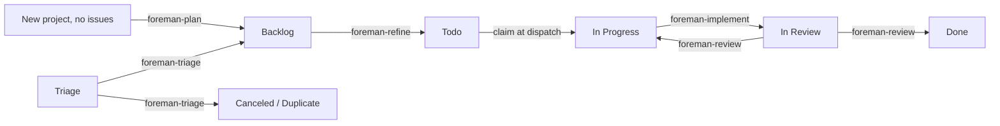

# Foreman

[](https://github.com/andyhite/foreman/actions/workflows/ci.yml)

An [omp](https://github.com/andyhite/oh-my-pi) plugin that runs a single-operator
agile SDLC over [Linear](https://linear.app). Agents move issues one state to the
right; you approve what they propose.

Foreman keeps no database. Linear is the state machine, the queue, and the audit
log. Every decision an agent makes lands as a Linear mutation or a comment, so
the board you already look at is the whole system state.

## The shape of it



Six workflow agents, each responsible for exactly one edge. None of them can
spawn another agent, and none of them can write to Linear — the `task` tool and
Linear's mutation API are both withheld, and the loop scrubs the Linear API key
from every dispatched agent's environment on both dispatch paths (print-mode
`omp -p` and the herdr terminal pane). The one residual exposure the code
cannot close: an implement agent still holds `bash`, so it can read
`linear.apiKeyFile` directly if the operator stores the credential that way.
A loop-dispatched deployment requires `linear.apiKeyFile` for this reason in
reverse, too: both dispatch paths (`packages/loop/src/repo.ts`,
`packages/loop/src/team.ts`) scrub `apiKeyEnv` from every dispatched agent's
environment, so the dispatched session's own extension — which needs a
write-capable Linear client to claim locks and apply results — can only
resolve a key from `linear.apiKeyFile` in that scrubbed environment. An
env-var-only deployment cannot support loop dispatch.
An agent returns a validated structured result; the extension performs the
mutation. That split is the design. (The `bash` boundary above is
defense-in-depth, not a sandbox — issue content is untrusted input.)

| Agent | Edge | Model | Produces |
| --- | --- | --- | --- |
| `foreman-triage` | Triage → Backlog / Canceled / Duplicate | `@smol` | A priority, a `type:` label, dedupe findings |
| `foreman-plan` | New project (zero issues) → Backlog | session | A first slate of draft issues from the project brief |
| `foreman-roadmap` | Initiative brief → sequenced projects | session | Projects with dependency edges and start/target dates |
| `foreman-refine` | Backlog → Todo | session | Acceptance criteria, a Fibonacci estimate, a split proposal |
| `foreman-implement` | In Progress → In Review | session | A branch, tests, a PR, per-criterion evidence |
| `foreman-review` | In Review → Done / In Progress | `@slow` | Findings by severity against the diff |

Sequence is expressed as native Linear relations, not as dates or a reading
order: `foreman-roadmap` wires `dependency` edges between projects and
`foreman-plan` wires `blocks` edges between the issues it drafts. The loop
reads them back as gates — a project with an unshipped prerequisite is not a
planning candidate, and an issue with an open blocker is neither refined nor
implemented — so a roadmap laid out in Linear is the order work actually
happens in.

An agent that cannot proceed does not guess and does not stall. It yields a
`BlockRecord` naming the question and the options, which becomes a `blocked:`
label and an entry in the drain you resolve with one keypress.

## Install

Requires [Bun](https://bun.sh) 1.3+, `git`, `gh` authenticated for the repos
Foreman will open PRs against, and [omp](https://github.com/andyhite/oh-my-pi).
Foreman isn't published as a standalone package, so getting the CLI means a
one-time clone-and-build — after that, `foreman setup` points one global
symlink at this checkout, and every repo you `foreman init` follows it.

The one-line installer clones the checkout to `~/.foreman/src`, builds it,
drops a `foreman` wrapper on `$PATH` (`~/.local/bin` by default), and launches
`foreman setup`:

```bash
curl -fsSL https://raw.githubusercontent.com/andyhite/foreman/main/scripts/install.sh | bash
```

It's re-runnable — running it again pulls the latest checkout, rebuilds, and
re-runs setup on top of your existing `~/.foreman/config.json`. Extra
arguments pass straight through to `foreman setup`, e.g.
`... | bash -s -- --yes`. To bring an already-installed machine current after
Foreman changes land on GitHub, don't re-run the installer — use
`foreman update` (below); it pulls, rebuilds, and every registered repo picks
up the change automatically, with no per-repo work. Prefer to do it by hand:

```bash
git clone https://github.com/andyhite/foreman
cd foreman
bun install && bun run build
bun run packages/cli/dist/main.js setup --yes
```

`foreman setup` is the one-time-per-machine installer: it checks for
`bun`/`git`/`gh`/`omp`/`herdr`, walks you through the Linear API key, and
writes a single symlink, `~/.foreman/plugin -> <checkout>/packages/omp-plugin`
— the one indirection every repo's plugin link points through. It never
touches repos, initiatives, or teams, and it never activates the plugin in
any repo itself — that happens per repo, below, as part of `foreman init`. If
`$LINEAR_API_KEY` is already set, setup skips the key prompt entirely — the
loop and extension resolve the key the same way at runtime, so setup does not
call Linear to validate it. Without a key (or without network access to
Linear), setup skips writing one — set `$LINEAR_API_KEY` or
`linear.apiKeyFile` yourself before starting the loop. When you do paste a
key, it always writes to the fixed path `<home>/.foreman/linear-api-key` at
mode `0600`; there is no prompt for where to store it. Pass `--link` to
symlink the `foreman` CLI to a wrapper that execs this checkout's TypeScript
**source** directly via `bun` — not the built `dist/main.js` — so a source
edit takes effect with no rebuild; dev mode for the CLI only, unrelated to the
omp plugin link. Drop `--yes` to be walked through the prompts interactively
instead. Flags: `--link`, `--checkout <path>` (defaults to auto-detecting this
checkout), `--skip-linear`, `--home <path>`, `-y`/`--yes`.

Once setup has run, register each repo Foreman will manage — and activate its
plugin **in that repo only** — by running `foreman init` **inside that
repo**:

```bash
cd ~/Code/my-app
foreman init
```

`foreman init` resolves the repo root with `git rev-parse --show-toplevel`,
then writes `<repo>/.omp/plugins/omp-plugins.lock.json` and
`<repo>/.omp/plugins/node_modules/@foreman/omp-plugin`, a symlink to
`~/.foreman/plugin` (skip both with `--skip-plugin`), plus a
`.git/info/exclude` line so that machine-local state never shows up in `git
status`. It then lists every product (initiative) in your Linear workspace as
a checkbox picker (`↑`/`↓` to move, `space` to toggle, `a` to toggle all,
`enter` to confirm) — pre-checking any already mapped to this repo — and
scrolls with `↑ N more` / `↓ N more` when the list is taller than the
terminal. It then asks for the team and alias. You confirm or edit every
choice before it's written to `~/.foreman/config.json`. `--initiative
<uuid>[:subdir]` binds one or more initiatives (repeat the flag; the optional
`:subdir` is the per-initiative subdirectory binding); `--alias <name>` and
`--team <KEY>` override the registry alias and Linear team key.
`--skip-linear` takes manual initiative ids instead of querying the API;
`--path <dir>` registers a directory other than the current one; `-y`/`--yes`
accepts every default and pre-checked value non-interactively — on a repo
with no prior registration that means nothing is selected and init fails
unless you also pass `--initiative`. `foreman init` never prompts for or
writes the Linear API key — that's `foreman setup`'s job.

Run `foreman deinit` inside a repo to undo `foreman init`: it removes the
plugin lock and symlink under `.omp/plugins/` and, unless you pass
`--keep-registry`, drops the repo's entry from `~/.foreman/config.json`.
`--path <dir>` targets a directory other than the current one.

Run `foreman doctor` any time to check whether the global plugin link and
every registered repo's activation are healthy — a broken symlink or a stale
lock entry are each reported as a problem. Pass `--fix`
to repair what it can (re-running the equivalent of `activateRepoPlugin` for
each affected repo); `--checkout <path>` overrides which checkout it expects
the global link to point at. It exits `0` when healthy, `1` when it found
problems `--fix` didn't (or wasn't asked to) resolve.

**Already have the old machine-wide install?** `foreman setup` used to
register an omp marketplace and let `omp plugin install` land the plugin
user-scoped, so it loaded in every omp session, including repos that never
use Foreman. `foreman doctor` detects that leftover automatically and
`foreman doctor --fix` removes it — no manual `omp plugin uninstall` step is
needed. Then run `foreman init` in each repo that should actually have
Foreman.

## Updating

After pushing plugin or CLI changes to GitHub, `foreman update` is the single
command that brings a machine current — it pulls the checkout and rebuilds
the CLI; the plugin loads straight from source, so pulling the checkout is
all it needs. Because every registered repo's plugin link resolves through
`~/.foreman/plugin` into this one checkout, that pull-and-rebuild is the
entire update: no per-repo work happens.

```bash
foreman update
```

Flags:

| Flag | Does |
| --- | --- |
| `--checkout <path>` | Path to the foreman checkout (default: auto-detected). |
| `--skip-pull` | Rebuild without touching git. |
| `--skip-plugin` | Update the checkout only; leave the global plugin link alone. |
| `--home <path>` | Home directory for `~/.foreman` (default: real home; test hook). |

`--checkout` is shared with `setup`; `--skip-plugin` is shared with `init`;
`--home` is shared by every command above. Don't reach for a bare `git pull`
by hand — `foreman update` rebuilds and revalidates the global plugin link in
the order that keeps every registered repo working, not just the one you're
standing in.

`foreman init` writes an entry like this to `~/.foreman/config.json`'s
`repos` table — or edit it directly:

```json
{
  "repos": {
    "my-app": {
      "path": "~/Code/my-app",
      "initiatives": ["a1b2c3d4-0000-0000-0000-000000000000"]
    }
  },
  "linear": {
    "apiKeyEnv": "LINEAR_API_KEY"
  }
}
```

Foreman reads the Linear personal API key from `$LINEAR_API_KEY`, or from
`linear.apiKeyFile` when the env var is unset — `foreman setup` writes that file
for you (mode `0600`) if you paste a key during the prompt. The `repos`
registry, keyed by alias, is the single table binding a repo to a team and the
initiatives it hosts, each entry written by one `foreman init` run; an issue
whose project has no initiative, or whose initiative isn't bound to any
entry, is skipped rather than guessed at. A monorepo lists several
initiatives on one entry.

Order of operations: `foreman setup` once per machine, `foreman init` once
per repo, `foreman update` whenever Foreman changes on GitHub need to reach
this machine, then Foreman is **one `foreman repo` instance per repo**: run
`foreman repo [alias] [--team <KEY>]` inside each Foreman-managed
repo — the instance's entry resolves by matching cwd against registry paths,
or the positional alias overrides. The shared Triage inbox is consumed separately, by one
team-level `foreman team [key]` process — not by any repo
instance.

Once installed, day-to-day use is `foreman repo` (below) and the `/foreman:*`
slash commands inside any omp session. See [Development](#development) below
if you want to hack on Foreman itself instead of just running it.

## Running the loop

The supervisor polls Linear and dispatches whatever the gates allow.

```bash
foreman repo --once             # one tick, asking before each action
foreman repo --mode yolo        # unattended
```

`loop.mode` is the global fallback and defaults to `confirm`, so a loop
started before you are ready asks before every agent dispatch and every
Linear mutation instead of acting on them — reads are never gated, and the
loop still evaluates every worker's predicate and logs its intent either
way. Declining is how you get a dry run: say no to everything and the loop
only ever logs. Override an individual worker in `loop.workerModes` when you
want to validate the pipeline one step at a time — `{ "review": "yolo" }`
lets `review` dispatch unattended while every other worker still asks first.
`confirm` mode needs a terminal: a loop started with any worker's effective
mode resolving to `confirm` and no TTY attached refuses to start rather than
declining everything silently.
Every tick logs a per-worker summary plus each dispatch intent and every
routing skip to stdout by default. `foreman repo` does take `--verbose`: it
adds per-item skip reasons, timings, and dispatch handles on top of that
default output. `foreman team` takes `--verbose` too, where it adds the skip
reason for each triaged issue.

```
[foreman-repo:plotroom] confirm: dispatch foreman-plan for project Plotroom
[foreman-repo:plotroom]   command: /foreman:plan 8f2c1d90
[foreman-repo:plotroom]   cwd: /Users/you/Code/plotroom
Proceed? [y/N] y
[foreman-repo:plotroom] plan [mode: confirm]: 1 dispatched, 0 would dispatch, 43 skipped
[foreman-repo:plotroom]   ✓ dispatched plan [mode: confirm] 8f2c1d90: "Plotroom" has no issues yet.
```

The `foreman-repo` prefix names the long-lived process, not the command — the
same spelling herdr uses for its pane. The loop is a singleton: a second one
refuses to start while the first holds the lock.

### Control plane

Each loop process — a repo's `foreman repo` and the team-level `foreman
team` — serves a unix socket at `<loop.stateDir>/<loop>/control.sock`,
speaking newline-delimited JSON, and publishes `<loop.stateDir>/<loop>/status.json`
after `reconcile()` and after every tick. Ops: `hello`, `snapshot`,
`subscribe`, `pause`, `resume`, `stop`, `tick`, `setMode`, `patchConfig`,
`reload`, `attachAgent`, `killAgent`, `logs`. `stop` takes
`mode: "graceful" | "now"`: both transition to `draining` and release the
lock once shutdown completes. `"graceful"` lets the in-flight tick finish
every worker in the pass; `"now"` cuts the tick short between workers, wakes
the poll wait immediately, and leaves in-flight dispatches to expire at lock
TTL. The socket is live control; the file is the fallback a client reads
when nothing is listening, which lets a status-reading client render a
stopped loop's last-known state instead of an error. Run `foreman repo
--no-control` to skip the socket entirely.

## Operator surface

Slash commands, inside any omp session:

| Command | Does |
| --- | --- |
|`/foreman:roadmap`|Decompose an initiative's brief into sequenced projects — dependency edges and start/target dates derived from what already exists. Takes `<INITIATIVE-ID>`.|
|`/foreman:status`|Foreman operator console: blocked queue, locks, proposals, agents, loop state.|
|`/foreman:apply`|Apply approved triage proposals, or approve/reject one by issue id. Takes `[--yes]`, or `<ISSUE-ID> --approve`, or `<ISSUE-ID> --reject <reason>`.|
|`/foreman:merge`|Merge one issue's PR (or branch) once the review gate passes. Takes `<ISSUE-ID>`. Operator-invoked only.|
|`/foreman:unblock`|Record the operator's reply to a blocked issue and clear its `blocked:*` label. Takes `<ISSUE-ID> <reply>`.|

## Development

```bash
git clone https://github.com/andyhite/foreman
cd foreman
bun install && bun run build
bun run setup          # setup --link, straight from source
```

```bash
bun run typecheck      # tsc --build --force across the workspace
bun test
bun run contract       # agent/skill/schema wiring check
bun run schemas        # regenerate output schemas into agent frontmatter
bun run check          # typecheck + test + contract
```

`omp.extensions` names `./src/extension.ts` directly, so the plugin has no
build step and no artifact — a plugin source change just needs a commit.