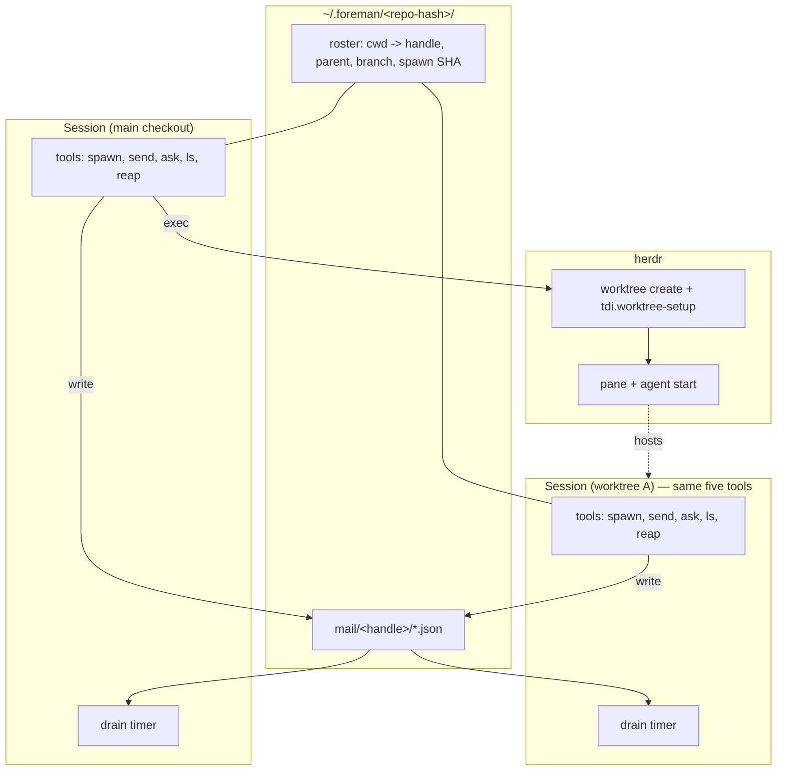

# Foreman architecture

A clean-sheet design for the primary use case: **one boss agent dispatches work
to peer agents that each own a worktree and a branch, answers their questions,
and collects their reports.** Worker-to-worker messaging is explicitly out of
scope.

This document ignores the current implementation. Where it names something that
exists today, it is to record why the replacement differs.

## 1. Diagnosis: the terminal is the wrong transport

Everything clunky about the current design traces to one decision: messages
travel as **keystrokes pasted into a TUI** (`herdr agent prompt`). That single
choice forces every downstream problem.

| Consequence | Why it follows |
| --- | --- |
| Delivery can be refused | A busy agent's TUI rejects paste; the CLI reports `agent_blocked` and the sender must retry. |
| No urgency | A keystroke is a keystroke. A worker's "I am blocked" and a routine report arrive identically. |
| No correlation | Text in, nothing out. Confirming receipt needs counters, marker files, and a freshness protocol. |
| Protocol lives in prose | Because the transport can't enforce anything, three skills of instructions ask agents to behave. |
| State lives in bash | Handles, counters, dispatch/report ledgers, poll loops, deadline arithmetic — 2770 lines of bash 3.2 holding the system together. |

The fix is not to harden that path. It is to stop using it.

## 2. The primitive: in-process delivery via the omp extension API

An omp extension loaded in a session can inject a message into that session at
any time, from a background timer, with a choice of urgency:

```ts
pi.sendMessage(
  { customType: "dev.foreman.inbox", content: text, display: true, attribution: "user" },
  { deliverAs: "steer" | "followUp", triggerTurn: true },
);
```

Measured behaviour on omp v18.0.5 (see §8 for the runs):

| Situation | `steer` | `followUp` |
| --- | --- | --- |
| Agent mid tool call | **Aborts the in-flight tool** within a millisecond, drops the rest of the turn's planned calls | Lets the whole run finish, then delivers as a new turn ~18 s later |
| Agent mid text stream | Waits for the turn to end (no checkpoint exists mid-text) | Waits for the turn to end |
| Agent idle | Delivers and starts a turn in 1–30 ms | Same |

That is exactly the two-level urgency the domain needs, and it is enforced by
the runtime rather than requested in prose.

Two rules fall out of the measurements and are non-negotiable:

1. **Always pass `triggerTurn: true`.** It is the flag that wakes an idle
   receiver; `deliverAs` only chooses what happens to a *busy* one. Omit it
   and the message is stored for a next user prompt that never arrives in a
   worker pane. This is also why `pi.sendUserMessage` is unusable here: it
   accepts no `triggerTurn`.
2. **Arm the drain with `ctx.setInterval`, never bare `setInterval`.** A throw
   from a bare timer reaches `uncaughtException` and kills the session; the
   `ctx.` variants contain throws and auto-clear on `session_shutdown`.

## 3. Layers



### 3.1 Identity — the repo family, keyed by git itself

```
git rev-parse --path-format=absolute --git-common-dir
```

Returns the **identical absolute path** from the main checkout and from every
linked worktree (verified). Hash it; that is the bus directory:

```
~/.foreman/<hash>/
  roster/<handle>.json      handle, parent, cwd, branch, spawn SHA, pane
  mail/<handle>/<seq>.json  pending messages for that handle
  done/<handle>/<seq>.json  delivered, kept as audit trail
```

Every participant in a repo family resolves the same directory with **zero
configuration and no environment plumbing**. Nothing is ever written into the
repo a worker operates on.

Rejected alternative: keying on cwd. omp's own broker scopes by working
directory, which puts each worktree in a different scope — precisely the wrong
split for a system whose whole job is to span worktrees.

### 3.2 Self-identification — by cwd, no env, no claiming step

One worker per worktree, one worktree per branch, so `ctx.cwd` is a unique key
by construction. A session resolves its own identity by matching its cwd
against the roster, and self-registers if no entry exists yet. Nothing has to
survive `herdr agent start`, no environment variable is plumbed anywhere, and a
session that is restarted or reattached re-identifies itself for free.

There is no separate step where an agent claims a handle. `foreman_spawn`
writes the child's roster entry before starting it, and the one session nobody
spawned — the checkout a human opened — takes a handle derived from its
directory name.

`HERDR_PANE_ID` is a fallback, not the primary key.

### 3.3 Transport — a durable mailbox, drained in-process

Send: serialise the message, write to `mail/<recipient>/.tmp-<n>`, `rename()`
into place. Rename is atomic on every filesystem that matters, so a reader
never observes a partial message.

Receive: an `fs.watch` on the session's own mailbox directory reads it,
**coalesces everything pending into one rendered message**, calls
`pi.sendMessage` once, then moves the files to `done/`. A 5 s `ctx.setInterval`
backstop drains too, because FSEvents coalesces under load and a deleted
directory kills its watcher outright — `foreman_reap` deletes mailboxes.

Coalescing matters: omp's `followUpMode` defaults to `one-at-a-time`, so three
separate injections would arrive across three turns. Batching sidesteps the
queue mode instead of fighting it.

Cost: nothing while idle. The watcher replaced a 250 ms poll, and the poll's
real expense was never the `readdir` — each drain calls `gitFacts`, which
shells out to `git rev-parse` twice, so an idle worker was spawning **eight git
subprocesses per second, forever**. Now that only happens when mail actually
arrives. No daemon, no socket, no MCP sidecar, no broker, no port. Survives a
worker restart because undelivered mail is still on disk.

Rejected alternatives, and why:

- **`omp --mode rpc` / `omp acp`** — stdio, spawn-only. They start a *new*
  session; there is no way to attach to the interactive session a human is
  watching in a herdr pane.
- **MCP server push** — servers are per-session, so a shared bus would need
  HTTP/SSE plus `Mcp-Session-Id` sticky routing; and notifications are
  processed at boundaries, so they cannot interrupt a turn anyway. All that
  infrastructure to end up strictly weaker than a file rename.
- **`/collab` WebSocket relay** — needs a network relay for a same-machine
  problem, and guest powers are human-shaped (prompt, interrupt) rather than
  typed routing.
- **omp `hub`** — in-process subagents only. Not a cross-process surface.

### 3.4 Delivery semantics — the verb carries the urgency

Urgency is not a parameter. It is the difference between two tools:

| Tool | `deliverAs` | Effect on the receiver |
| --- | --- | --- |
| `foreman_ask` | `steer` | Aborts the receiver's in-flight tool call, delivers at the next boundary. |
| `foreman_send` | `followUp` | Waits for the receiver's current run to finish, then delivers as a new turn. |

One rule, memorable: **only a stalled agent may interrupt.** `foreman_ask`
ends the asking session's turn, so by construction the sender has already
stopped working before it interrupts anyone.

Everything else — dispatching a task, answering a question, filing a report,
broadcasting a notice — is `foreman_send`, and therefore cannot interrupt a
change in progress. That is deliberate: a half-applied edit is the worst
outcome in this system, so no tool exists to cause one. An agent that must be
stopped is a lifecycle problem (`foreman_reap`), not a message.

### 3.5 One uniform surface — no roles

Every session registers the same five tools. There is no boss mode, no worker
mode, no role field, and no capability split.

"Boss" and "worker" survive only as names for the two ends of a **spawn edge**:
whoever called `foreman_spawn` is the parent, the session it created is the
child. The roster records `parent`, and that one field carries every asymmetry
the system needs:

- `foreman_ask` takes no `to` — it goes to your parent, the one agent waiting
  on you.
- `foreman_ls` shows the children you spawned.
- `foreman_reap` accepts only a handle you are the parent of.
- The session nobody spawned cannot `foreman_ask`; the tool reports that there
  is no one to ask.

This composes in a way role typing could not: a child that spawns children of
its own is a parent on one edge and a child on another, with no new concept and
no configuration. And worker-to-worker messaging stays out of scope
structurally rather than by policy — `foreman_send` resolves handles through
your own edges, and a sibling is not on any of them.

Prose shrinks accordingly. Skills stop explaining a protocol and start
explaining judgement: what makes a good brief, when to ask versus decide.

### 3.6 Lifecycle — herdr, used thinly

herdr keeps the two jobs it is uniquely good at: worktrees that are *set up*,
and panes a human can watch and take over.

1. `herdr worktree create --branch <b> --base <spawn-point>` — creates the
   workspace, tab, and pane, and runs `tdi.worktree-setup` (env file copying,
   mise trust). Plain `git worktree add` skips that, which is why creation must
   go through herdr.
2. Record the **spawn-point SHA** in the roster. This is the baseline every
   later "is this branch merged?" question is measured against.
3. `herdr agent start omp --pane <root-pane>` in the returned pane.
4. Reap: refuse if `git status --porcelain` is non-empty, or if
   `git rev-list <spawn-point>..<branch>` is non-empty and the branch is not
   merged. Then `herdr worktree remove --workspace <id>` — removal must match
   creation (see `rule://herdr-worktrees`).

The extension shells out to herdr directly. No bash CLI sits in between.

### 3.7 Liveness — optional, not load-bearing

herdr's event socket can push `pane.exited` and agent status changes, letting
the boss notice a dead worker without polling. Worth adding, but the mailbox
already tolerates a slow or restarted worker, so this is an enhancement rather
than a dependency.

## 4. Contract surface

Five tools, identical in every session.

| Tool | Contract |
| --- | --- |
| `foreman_spawn` | handle, branch, base, brief → worktree + pane + agent; records you as parent and delivers the brief. One worker per branch. |
| `foreman_send` | to, text → `followUp` to a handle on one of your edges. Covers dispatch, answer, and report — they differ only in direction. |
| `foreman_ask` | text → `steer` to your parent, then end your turn and wait. |
| `foreman_ls` | the children you spawned: state, branch, ahead/behind the spawn point, last message. |
| `foreman_reap` | handle → refuses dirty or unmerged unless forced; otherwise removes the worktree and roster entry. |

Sending returns a **tool result**, and receiving arrives as a real user turn.
Neither end ever parses a pane's scrollback.

## 5. What this deletes

- The 2791-line bash 3.2 CLI and its 3375 lines of tests, and with them:
  associative-array workarounds, `LC_ALL=C` collation traps, string-compared
  counters, `test -nt` whole-second resolution, absolute-deadline polling.
- The MCP sidecar, and the class of bug where a manifest declares a server
  that never starts and every delivery silently falls back.
- The freshness protocol — dispatch and report counters exist only to
  compensate for a transport that cannot confirm delivery.
- Roles, and everything that existed to guard them: handle claiming,
  boss-handle validation, the phantom-worker check, boss rebinding.
- Most protocol prose in the three skills.

What survives as ideas rather than code: handles as the only worker
identifier, all state under a state root keyed by handle, nothing written into
the worker's repo, and the house rule that every comment names the bug it
prevents.

## 6. Build order

Step 0 is deletion. Nothing after it reuses anything before it.

0. **Clean slate.** Delete the 38 KB `extension/index.ts` and its 13 KB test;
   all five `herdr/bin/foreman*` scripts and all three `herdr/test/*.sh`
   suites (7419 lines of shell); all three `skills/foreman-*/SKILL.md` (692
   lines); all three `command-prompts/*.md` (236 lines); and `.mcp.json`.
   Keep `package.json`, `.omp-plugin/plugin.json`, `tsconfig.json`,
   `herdr/herdr-plugin.toml`, `herdr/install.sh`, and the CI workflow. Rewrite
   the README last, once the tools are real.
1. Bus, roster, mailbox, and the drain timer. Prove a message crosses from one
   omp session to another.
2. `foreman_spawn` end to end: worktree, pane, agent, brief delivered.
3. `foreman_ask` and `foreman_send`, with the `steer`/`followUp` split.
4. `foreman_ls`.
5. `foreman_reap` with the dirty and unmerged guards.
6. Skills rewritten as judgement, not protocol.

Each step is independently demonstrable, which matters because the delivery
layer is the only part that was ever hard.

## 7. Risks

| Risk | Mitigation |
| --- | --- |
| A watcher can miss events | The 5 s `ctx.setInterval` backstop drains unconditionally, so a missed event costs latency, never delivery. `FOREMAN_BACKSTOP_MS` tunes it. |
| `steer` mid-text-stream waits for the turn | Accepted. The only `steer` sender is `foreman_ask`, so the sender is already stalled; a few seconds is irrelevant. |
| At-least-once could double-deliver | Move to `done/` after injection and key on sequence number; a duplicate is visible in the audit trail. |
| omp caches transpiled extensions by path | Development-time only: bump the path or reinstall. Cost us two misleading runs during research. |

## 8. Evidence

Measured against omp v18.0.5 with a purpose-built probe extension, driven both
over RPC and in interactive TUI mode. The delivery rows were re-measured after
the `pi.sendUserMessage` → `pi.sendMessage` cutover; the probe fires one
injection 4 s into a 20 s `sleep` and logs the event timeline.

| Claim | How it was shown |
| --- | --- |
| `steer` aborts an in-flight tool call | Fired 4.0 s into a 20 s `sleep`: `tool_execution_end` followed 1 ms later, the remaining calls were dropped, and the message landed 33 ms after that. Identical under `sendUserMessage` (5 ms). |
| `steer` does not abort a text-only turn | Injected 3.35 s into a 60-number count. The turn ran to `stop=stop` at 16.73 s; the message landed at 16.78 s. `interruptMode: immediate` only checks between tool calls. |
| `followUp` waits for the whole run | Fired 4.0 s into a 20 s `sleep`: the tool ran its full 20.0 s, the turn completed, then the message was delivered on its own turn 17.7 s after firing. |
| `followUp` + `triggerTurn` wakes an idle agent | Session idle from 4.06 s, fired at 16.06 s → `agent_start` 1 ms later, delivered at 16.09 s. `nextTurn` behaves identically (idle 3.10 s, fired 15.10 s, `agent_start` +13 ms). |
| `triggerTurn` is the load-bearing flag | `{ deliverAs: "nextTurn" }` without `triggerTurn` was accepted, never delivered, and the session exited with the message still queued for a user prompt that never came. |
| `pi.sendMessage` is not dropped on v18.0.5 | The earlier "accepted without error, never delivered" result does not reproduce: `{ followUp, triggerTurn: true }` delivered in both the mid-run and idle probes above. The original failure was `sendUserMessage`-shaped — that API has no `triggerTurn` — not a `sendMessage` bug. |
| `pi.sendMessage` returns no receipt | Returns `undefined`, not a promise, in every run. The drain's retry path can therefore only fire on a synchronous throw. |
| Injection works from a detached `ctx.setInterval` | ~12 runs, zero `extension_error` frames. |
| It works in interactive TUI mode | Real `omp` under a PTY: injected at 807.22, `agent_start` at 807.25 (30 ms), and the session transcript contains the injected `user` message followed by the assistant's `ACK-TUI`. |
| Worktrees share one git identity | `--path-format=absolute --git-common-dir` returns `/private/tmp/fmgit/main/.git` from both the main checkout and its linked worktree. |
| `fs.watch` beats the poll by ~5× | Mailbox write → `agent_start`, backstop pinned to 60 s so only the watcher could fire: 24, 78, 20, 25 ms across four seeds. The 250 ms poll it replaced averaged 125 ms. Most of the residual is `gitFacts`' two `git rev-parse` calls, not the watcher. |
| Worktrees do *not* share a broker scope | Same repo, identical `--git-common-dir` from both, but `hub` process ops landed in `~/.omp/run/daemons/5c4c249b77c3672d/` from the main checkout and `e8ff34fb34698007/` from a linked worktree. The scope key is cwd-derived, so cross-process `hub` messaging would still not reach a sibling worker. |
| An async job settling wakes an idle session | Backgrounded `sleep 12 && echo …` returned at 2.52 s, session went idle at 4.69 s, and the job's output arrived as a `custom` message that started a turn at 14.57 s. Delivery of a blocking CLI's result therefore needs no new omp surface. |
